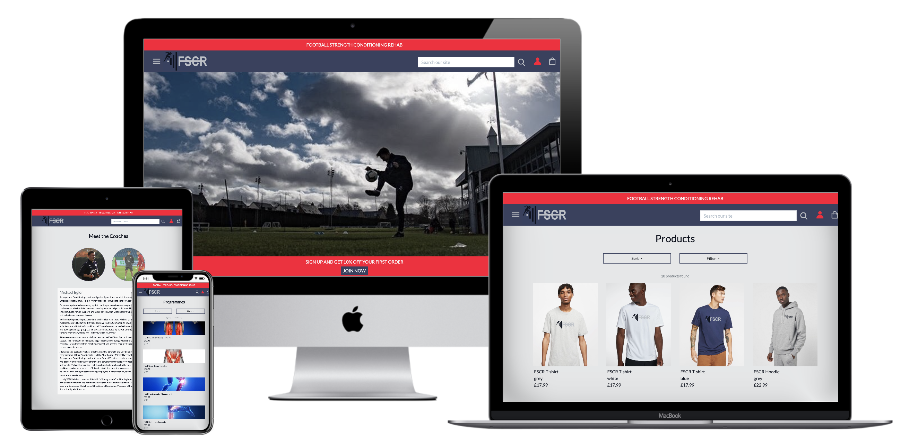
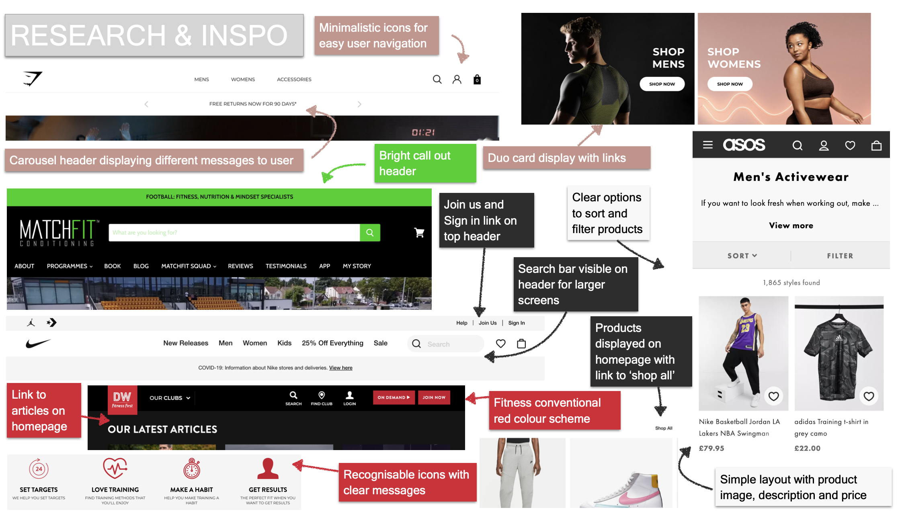
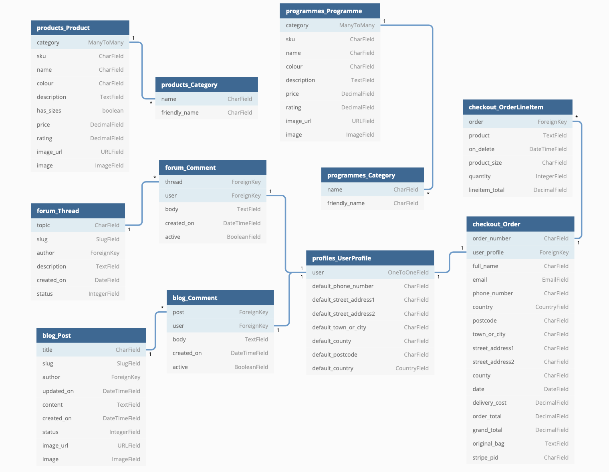
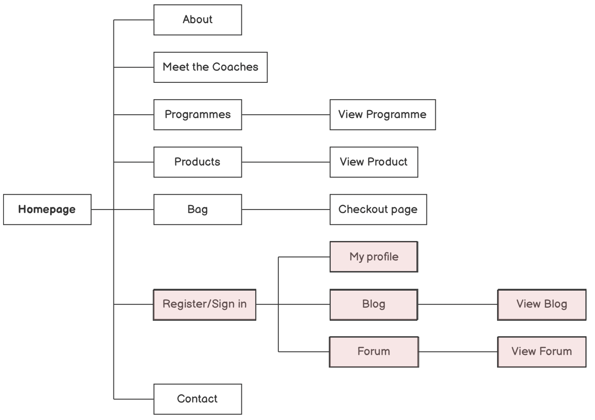
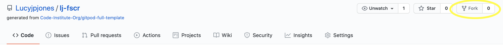
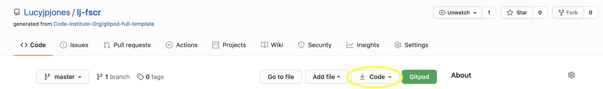
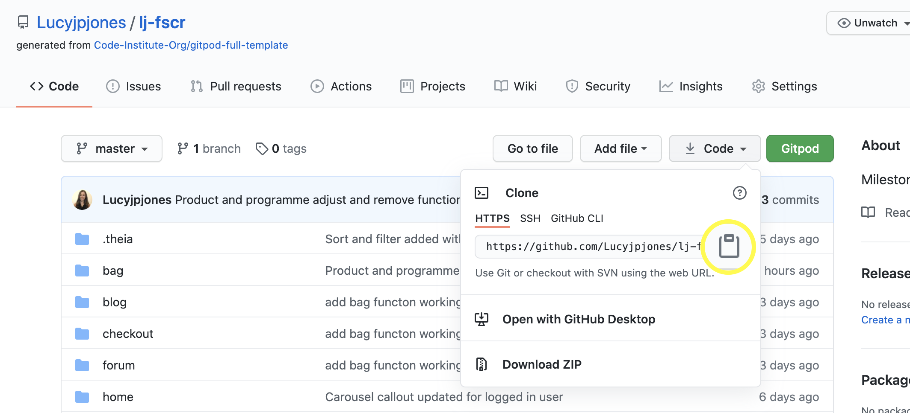

<div align="center">
  
<hr>

**FSCR (Football Strength Conditioning Rehab) focuses on providing structured and detailed fitness programmes for football related injuries.**

This app was built using [GitHub](https://pages.github.com/) and deployed to [Heroku](https://www.heroku.com/).

[View Site](https://lj-fscr.herokuapp.com/)

</div>

---

## <u>Table of contents</u>

**<details><summary> User Experience (UX)</summary>**
  - [Purpose](#purpose)
  - [Design](#design)
  - [User stories](#user-stories)
  - [Data Schema](#data-schema)
  - [Wireframes](#wireframes)
</details>

**<details><summary> Features</summary>**
  - [Features used](#features-used)
  - [To do list](#to-do-list)
  - [Status](#status)
</details>

**<details><summary> Technologies</summary>**
  - [Languages](#languages)
  - [Frameworks, Libraries & Programs](#frameworks-libraries-programs)
</details>

**<details><summary> Deployment</summary>**
  - [Deploy to Heroku](#deploy-to-heroku)
  - [Deploy to AWS](#deploy-to-aws)
  - [Accessing code](#accessing-code)
</details>

**<details><summary> Testing</summary>**
  - [Testing Documentation](https://github.com/Lucyjpjones/wean-cuisine/blob/master/testing.md)
</details>

**<details><summary> Credits</summary>**
  - [Content](#content)
  - [Media](#media)
  - [Acknowledgements](#acknowledgements)
</details>

**<details><summary> Contact</summary>**
  - [Contact details](#contact-details) 
</details>
---

# &rarr; **User Experience (UX)**

### **<u>Purpose</u>**

**FSCR** (Football Strength Conditioning Rehab) focuses on providing structured and detailed fitness programmes for football-related injuries. This is a full-stack site that has been created around business logic and used to control a centrally-owned dataset.

This application was built for a client who is currently looking to utilise their expertise in football rehabilitation by creating easy-to-follow fitness programmes. Rehabilitation after an injury can often be overlooked and my client is extremely passionate about ensuring athletes get the full recovery they need to get back to their sport and prevent further injury.

By completing this project I will have shown greater experience in HTML, CSS, and Javascript, and demonstrated my understanding of Python+Django. I will have also shown my competency in using a relational database, setting up an authentication mechanism, and providing payment transactions using stripe payments. 


### **<u>Design</u>**

**Structure**

- A simple design structure with a fixed navbar side navigation menu accessible from every page of the site. A brand logo is displayed in the top left of the screen to allow easy navigation back to the homepage.

- As well as including a page title on my base.html, I have also added the meta description tag to help optimize my click-through rate from search engine result pages.

**Colour scheme**

- After undergoing research into other fitness related sites and reviewing the [psychology behind colours](https://www.mypersonaltrainerwebsite.com/blog/how-to-use-color-psychology-to-create-the-perfect-fitness-website), I created my final palette using [Coolors](https://coolors.co).

> **Red:** Passion for the sport and a never-say-die attitude.

> **Purple:** Overcoming physical challenges and limitations and setting farther, more difficult goals.

> **Grey:** paragraph Calmness and neutrality, focus, and precision.

> **Blue:** Dependability, trust, and honesty

<br>
  

- The #f8f8f8 shade of very light grey has been used for as a background colour throughout the site with #fafafa shade of white used for forms.


**Typography**

- The font used throughout the site is 'Lato' which belongs to the sans-serif typeface family. The font is neutral and easily readable, making it a good choice for web design.

- Sans Serif as the fallback font if for any reason the font isn't being imported into the site correctly.

**Research**

- I spent some time researching other fitness and retail sites to gain inspiration and created a mood board with a collection of elements that caught my eye.


  

**Logo Design**

When it comes to creating a business, the logo is the central visual element in helping customers find, recognise and remember a brand. Taking this into consideration, I decided to spend some time creating a logo for FSCR which would represent the brand well.

I set up a meeting with my client and presented them with a moodboard of different designs and gathered their feedback.

  

My final design with client approval below;


### **<u>Data Schema</u>**



The **Product model** within the products app, is used to store information about individual products.
The **Category model** within the products app, is used to group products into specific categories.

The **Programme model** within the programmes app, is used to store information about individual programmes.
The **Category model** within the programmes app, is used to group programmes into specific categories.

The **UserProfile** model within the profiles app is used to store users profile information and is connected to various apps for other benefits;
- Checkout app - to store users checkout information, as well as order history.
- Blog app - allows users to leave a comment with their username automatically displayed.
- Forum appp - allows users to leave a comment with their username automatically displayed.

The **Post model** within the blog app, is used to store posts added by the admin user.
The **Comments model** within the blog app, is used to store comments added by the user who is logged in.

The **Thread model** within the forum app, is used to store threads added by the user.
The **Comment model** within the forum app, is used to store comments made by the user logged in.

The **Order model** within the checkout app, is used to store orders.
The **OrderLineItem model** within the checkout app, is used to store information about individual orders.

### **<u>User Stories</u>**



* Boxes higlighted are only accessible when a user is registered and logged in.

<u>**User profiles**</u>

**User profile: Site Visitor**
As a site Visitor, I want to be able to easily navigate around the site and gain a clear insight into its purpose. I would like to be able to browse the services and products on offer with the option to purchase. I would also like the ability of contacting the site owner if I require any further information and the option to register as a member for more resources.

**User profile: Site Member**
As a site member, I want to be part of a community where I can interact with other members around key topics to share each others knowledge, experience and progress. I would like to have my own user profile to store my personal details and order history, and the ability to easily log in and out of the site.

**User profile: Site Owner**
As the site owner, I want to be able to continually monitor and update the site to manage my user's expectations. I would like the ability to easily add, edit and delete products and programmes to ensure my site is always up to date and relevant, and add blogs for our site members. I want to provide a customer review option, to gain feedback for improvements and to develop a sense of transparency to gain consumer loyalty and trust.

<u>**User stories**</u>

|                   | As a / an    | I want to be able to….                                              | So that I can…                                                                                       |
|--------------------------------|--------------|---------------------------------------------------------------------|------------------------------------------------------------------------------------------------------|
| Viewing and Navigation         |              |                                                                     |                                                                                                      |
| 1                              | Site Visitor | Discover FSCR’s purpose and goals                                   | Learn more about the brand and the coaches behind it                                                 |
| 2                              | Site Visitor | View a list of products                                             | Select a product to view more details                                                                |
| 3                              | Site Visitor | View a list of programmes                                           | Select a programme to view more details                                                              |
| 4                              | Site Visitor | View a specific category of products                                | Quickly find products I’m interested in without having to search through all the products            |
| 5                              | Site Visitor | View individual product details                                     | Identify the description, price, available sizes, product image and rating                           |
| 6                              | Site Visitor | View individual programme details                                   | Identify the description, price, duration, rating and reviews                                        |
| 7                              | Site Visitor | Easily access contact details                                       | Send a message regarding any queries I have                                                          |
| 8                              | Site Visitor | See reviews and ratings on products and programmes                  | Be reassured that the product/programme is good                                                      |
| 9                              | Site Member  | Browse associated blogs, articles and recent new stories            | Learn more about football rehabilitation and keep up to date with news                               |
| 10                             | Site Member  | Forum                                                               | Be part of a community and speak to other coaches/athletes                                           |
| Registration and user accounts |              |                                                                     |                                                                                                      |
| 11                             | Site Visitor | Easily register for an account                                      | Have a personal account and be able to view my profile                                               |
| 12                             | Site Visitor | Receive an email confirmation after registering                     | Verify that my account registration was successful                                                   |
| 13                             | Site Member  | Easily login or logout                                              | Access my personal account information                                                               |
| 14                             | Site Member  | Easily update my personal details                                   | Change my details if needed                                                                          |
| 15                             | Site Member  | Easily recover my password in case I forget it                      | Recover access to my account                                                                         |
| 16                             | Site Member  | Have a personalised user profile                                    | View my personal order confirmations, order history and save my payment details for future purchases |
| 17                             | Site Member  | Enable my details to be prefilled                                   | Save time entering my details when making  future purchases                                          |
| Sorting and Searching          |              |                                                                     |                                                                                                      |
| 18                             | Site Visitor | Sort and filter the list of available products                      | Easily find the product I’m looking for                                                              |
| 19                             | Site Visitor | Sort and filter the list of available programmes                    | Easily find the programme I’m looking for                                                            |
| 20                             | Site Visitor | Search the site by keywords                                         | Easily find what I am looking for                                                                    |
| 21                             | Site Visitor | Easily see what I’ve searched for and the number of results         | Quickly decide whether the product or programme I want is available                                  |
| 22                             |              |                                                                     |                                                                                                      |
| Purchasing and checkout        |              |                                                                     |                                                                                                      |
| 23                             | Site Visitor | Easily select the size and quantity of a product when purchasing it | Ensure I don’t accidentally select the wrong product quantity or size                                |
| 24                             | Site Visitor | View items in my bag to be purchased                                | Identify the total cost of my purchase and all items I will receive                                  |
| 25                             | Site Visitor | Adjust the quantity of individual items in my bag                   | Easily make changes to my purchase before checkout                                                   |
| 26                             | Site Visitor | Easily enter my payment information                                 | Check out quickly with no hassles                                                                    |
| 27                             | Site Visitor | Feel my personal and payment information is safer and secure        | Confidently provide the needed information to make a purchase                                        |
| 28                             | Site Visitor | View an order confirmation after checkout                           | Verify that I haven’t made any mistakes                                                              |
| 29                             | Site Visitor | Receive an email confirmation after checking out                    | Keep the confirmation of what I’ve purchased for my records                                          |
| Admin and Store Management     |              |                                                                     |                                                                                                      |
| 30                             | Site Owner   | Add a product                                                       | Add new product lines to my products purchasing page                                                 |
| 31                             | Site Owner   | Add a programme                                                     | Add new programmes to my programme purchasing page                                                   |
| 32                             | Site Owner   | Edit/Update a product                                               | Change product prices, descriptions, images and other product criteria                               |
| 33                             | Site Owner   | Edit/Update a programme                                             | Change programme prices, descriptions and other programme criteria                                   |
| 34                             | Site Owner   | Delete a product                                                    | Remove items that are no longer available for sale                                                   |
| 35                             | Site Owner   | Delete a programme                                                  | Remove programmes that are discontinued                                                              |
| 36                             | Site Owner   | Add a blog                                                          | Add new blogs to share with site members                                                             |

### **<u>Wireframes</u>**

As part of the design process, I created wireframes using [Balsamiq](https://balsamiq.com/?gclid=Cj0KCQjw28T8BRDbARIsAEOMBczzBYzsoMjbTtqNXQaE1EgOWA2u_Qux7sLl2IUHe-p0lDC-294BfVgaAr-oEALw_wcB). Creating these mock-ups helped me plan the basic structure and arrangement of the features for my site.

- [Homepage](wireframes/wf-homepage.pdf)
- [Meet the Coaches](wireframes/wf-meet-the-coaches.pdf)
- [Profile](wireframes/wf-profile.pdf)
- [Products](wireframes/wf-products.pdf)
- [Product View](wireframes/wf-product-view.pdf)
- [Programmes](wireframes/wf-programmes.pdf)
- [Programme View](wireframes/wf-programme-view.pdf)
- [Shopping bag](wireframes/wf-bag.pdf)
- [Checkout](wireframes/wf-checkout.pdf)
- [Blog](wireframes/wf-blog.pdf)
- [Blog View](wireframes/wf-blog-view.pdf)
- [Forum](wireframes/wf-forum.pdf)
- [Forum View](wireframes/wf-forum-view.pdf)
---

## &rarr; **Features**

### **Features used**

- **Responsive on all device sizes**
  - Mobile-first design, responsive on all devices through using the Bootstrap grid system and CSS media queries.

- **A user-friendly interface with easy navigation throughout the site**
  - Attractive, minimalistic design with visuals and information presented clearly and concisely.

  - Easily readable fonts and simple navigation throughout the site.
    - Fixed navigation bar visible on every page including a menu dropdown, recognisable icons and brand logo to link back to the homepage.

  - An aesthetically pleasing 404 page if the user is directed to a non-existent page.

- **Buttons**
    - Clear interactive buttons used for a effortless user journey.

- **Forms**
  - Forms used for contact form, login and register, adding/editing products,programmes, adding forum threads, user comments, and checkout details.

  - Crispy forms used for elegant formatting.

- **Tabs**
  - Interactive tab used on 'meet the coaches' page used to switch between individuals details.

- **Card Listings**
  - Used to display products, programmes, and blogs.

  - Image included contributing to the visual look.

- **Carousel**
  - Used for testimonials and products displayed on the homepage.

- **Search bar**
  - Allows the user to search the site by keywords.

- **Sort**
  - Allows the user to sort.

- **Filter**
  - Allows the user to filter.

- **Toasts**
  - Used for success and error responses to add to the user journey.

- **Payments**
  - Stripe payments used to manage site card transactions.


### **To do list**

#### Status

> Project is: <u>ongoing</u>

I will continue to update my website to meet my clients expectations. I have further development plans which I have listed below.

**Future Development plans**
- Add more social logging in options for users.
- Add more payment options for my users, including apple pay to improve user experience with quicker checkout.
- Add a review option for members to give their opinion on products and programmes . As this is a startup there is currently no orders this was a lower priority to complete.

---

## &rarr; **Technologies**

#### Languages

- [HTML5](https://en.wikipedia.org/wiki/HTML5)
- [CSS3](https://en.wikipedia.org/wiki/Cascading_Style_Sheets)
- [JavaScript](https://www.javascript.com/)
- [Python](https://www.python.org/)

#### Frameworks, Libraries & Programs

- [**Django**](https://www.djangoproject.com/)

  - Python Web framework used to the build site.

- [**Boto3**](https://boto3.amazonaws.com/v1/documentation/api/latest/index.html)

- [**gunicorn**](https://gunicorn.org/)
   - WSGI server used to take care of everything happening between the web server and web application.

- [**pillow**](https://www.djangoproject.com/)

- [**psycopg2**](https://www.djangoproject.com/)

- [**AWS**](https://aws.amazon.com/)

  - A cloud-based storage service used to store static and ,media files.

- [**Stripe**](https://stripe.com/gb)

  - Stripe was used to deal with payments.

- [**Temp Mail**](https://temp-mail.org/en/)

  - Temp Mail was used to provide temporary, secure, anonymous, free, disposable email addresses for testing purposes.

- [**Google fonts**](https://fonts.google.com/)

  - Google fonts were used to import the fonts into the CSS file which is used on all pages throughout the project.

- [**Font Awesome 4.7.0**](https://fontawesome.com/)

  - Font Awesome was used to add icons for aesthetic and UX purposes.

- [**jQuery:**](https://jquery.com/)

  - jQuery came with Materialize to make the components used responsive.
  - Included at end of body tag within HTML file to ensure a smooth running of HMTL and CSS.

- [**Git**](https://git-scm.com/)

  - Git was used for version control by utilizing the Gitpod terminal to commit to Git and push to GitHub.

- [**GitHub**](https://github.com/)

  - GitHub is used to store the project code after being pushed from Git.

- [**Heroku**](https://github.com/)

  - Heroku is the app platform I deployed my project to.

- [**Flaticon**](https://www.flaticon.com/)

  - Provided icons throughout site.

- [**Balsamiq**](https://balsamiq.com/)

  - Balsamiq was used to create the wireframes during the design process.

- [**Grammarly**](https://www.grammarly.com/)

  - Grammarly was used to ensure any grammar errors are eliminated.

- [**HTML Formatter**](https://www.freeformatter.com/html-formatter.html) and [**CSS Formatter**](https://www.freeformatter.com/css-beautifier.html)

  - Used to format my HTML and CSS file with the desired indentation level for optimal readability.

- [**Tables Generator**](https://www.tablesgenerator.com/markdown_tables)

  - Used to create tables in my readme file.

- [**Favicon**](https://favicon.io/)
    - Used to create a favicon, displaying my logo on a web browser next to the web address bar, the browser tab, and the bookmarks bar.
---

## &rarr; **Deployment**

#### Deploy to Heroku

The project was connected to Heroku using automatic deployment from my GitPod repository, using the following steps...

> **Note:** Before following the below steps ensure you have already created your new repo in Github. Sensive data can either be added to your environment settings or stored in an env.py file. (Further details on adding an env.py file below)

1. Log in (or Register) to [Heroku](https://www.heroku.com/) and from your dashboard click 'new' > 'create new app'.

   

2. Enter your 'App name' and choose the appropriate region, then click 'Create app'.
   > **Note:** 
 The app name must be unique, all lowercase, and '-' to be used instead of spaces.
The region chosen should be the one closest to you.

   

3. Then on the 'Resources' tab, search and add on the Heroku Postgres database.

4. To use Postgres, install dj_database_url, and psycopg2 in the project terminal using the following commands;

   - pip3 install dj_database_url
   - pip3 install psycopg2

6. Freeze the requirements to ensure Heroku installs all the apps requirements when deployed using the following command;

   - pip3 freeze > requirements.txt

7. Go to settings.py and import dj database url;

   - import dj_database_url

   Then down in the databases setting comment out the default configuration and replace the default database with a call to dj_database_url.parse and give it the database URL from Heroku.
    > **Note:** You can either get the database url from your config variables in your app settings tab or from the command line by typing Heroku config.

8. Apply all migrations using the following command;

   - $ python3 manage.py migrate

    Your database should now be all set up.

9. Create a super user to log in with using the following command;

   - $ python3 manage.py createsuperuser


10. Go to the Settings tab on Heroku, scroll to the 'Config Vars' section, and click 'Reveal Config Vars'. 

   

   Enter variables (key and value) contained in the env.py file. The keys are listed below and values are inputted by the user.

        - AWS_ACCESS_KEY_ID
        - AWS_SECRET_KEY_ID
        - DATABASE_URL
        - DISABLE_COLLECTSTATIC 
        - EMAIL_HOST_PASS
        - EMAIL_HOST_USER
        - SECRET_KEY
        - STRIPE_PUBLIC_KEY
        - STRIPE_SECRET_KEY
        - STRIPE_WH_SECRET
        - USE_AWS

11. Install gunicorn using the following command;

    - $ pip3 install gunicorn

    Then freeze into your requirements file.

12. Create a Procfile and add the following line;

    - web: gunicorn lj_fscr.wsgi:application

    This tells Heroku to create a web dyno which will run gunicorn and serve the django app.

    > **Note:** The **P**rocfile must be assigned a capital P.

13. Last, you need to temporarily disable collectstatic to ensure that Heroku won't try to collect static files when we deploy. This is done by adding the below variable;

    - DISABLE_COLLECTSTATIC = 1

14. Add the hostname of your Heroku app to allowed hosts in settings.py

15. Now you can commit all the changes and push to github;

    - $ git add .
    - $ git commit -m <'your commit message'>
    - $ git push

    If you created your app on the website you will need to initialize your heroku git remote using the following command;
    - $ heroku git:remote -a lj-fscr

    Then use the follwing command to push to heroku;

    - $ git push heroku master 

**To set up Automatic deployment to Heroku**

1. From the Heroku deploy tab, select the Deployment method 'GitHub'.

    

2. On the 'Connect to GitHub' section make sure your GitHub profile is displayed then add your repository name and click 'Search'.

    > **Note:** This is the name of your repo in GitHub. It is good practice to use an identical name for your Heroku app.

    

3. Your repo should now be displayed below, click 'Connect' to connect to this app.

4. Go to the Deploy tab on Heroku and under the Automatic deployment section, click 'Enable Automatic Deploys'. Then under Manual deploy click 'Deploy Branch'.

   

   - Heroku will now receive the code from GitHub and start building the app using the required packages.
   - Once built you will receive the message 'Your app was successfully deployed' and you can click 'View' to launch your new app.

        > **Note:** 
        In Manual deploy dropdown 'master' is selected'


Add Secret key info!!!!!!!

#### Deploy to AWS

The project used Amazon Web Services s3, which is a cloud-based storage service,to store static and media files.

1. Create account by navigating to [aws.amazon.com](https://aws.amazon.com/) and clicking create an AWS account. Fill in your email and password, and a username for your account, and select continue.

2. Now on the account type page, select personal and fill out the required information, click create account and continue.

3. Next you will be asked to enter a credit card number which will be used for billing if we go above the free usage limits. Beyond this, you'll be asked a couple more verification questions then once all required information is confirmed your account will be created.

   > **Note**: For this project I didn't go anywhere near the usage limits but keep in mind that AWS is not free if you go above the free usage limits.

4. Now you can navigate back to [aws.amazon.com](https://aws.amazon.com/) and sign-in to your account.

5. Navigate to AWS management console under my account and using the 'find services' search bar, find s3.

6. Now open s3 and create a new bucket to store all your files.

- Enter a name for your bucket
    > **Note**: I'd recommend naming your bucket to match your Heroku app name.

- Select a region
    > **Note**: Select the region closest to you like you did when creating your heroku app.

- Uncheck block all public access and acknowledge that the bucket will be public.
    > **Note**: Allows public access to our static files.

- Click create bucket and your bucket should be created.

7. Now click into your new bucket and set some settings;

- On the properties tab and turn on static website hosting.

    > **Note**: For the index and error document, just fill in some default values.

- On the permissions tab 

  - Paste in a **CORS Configuration** to set up the required access between your Heroku app and this s3 bucket. Copy the code below supplied by CodeInstitute;

        [
        {
            "AllowedHeaders": [
                "Authorization"
            ],
            "AllowedMethods": [
                "GET"
            ],
            "AllowedOrigins": [
                "*"
            ],
            "ExposeHeaders": []
        }
        ]

  - In the **Bucket Policy** tab, select policy generator
    - Policy type is 's3 bucket policy'
    - Allow all principles using a *
    - Actions is 'GetObject'
    - Add in your ARN (found on previous page)
    - Click 'Add statement' then 'Generate policy'
    - Copy the policy code and paste it into the bucket policy editor

       > **Note:** To allow access to all resources in this bucket add a slash star onto the end of the resource key.
    
    - Click save

  - In the **Access Control List** tab, under the Public Access section, set the list objects permission to everyone.

8. Create a user to access the bucket created.

- Search for a new service 'Iam'
- Now open Iam, naviagte to 'groups' and click 'Create new group'

  > **Note:** You can call your group whatever you want but try to give it a name that makes sense to you for what it is.

- Create a policy by navigating to 'policies' and click 'Create policy'
- Go to json tap and click 'import managed policy'
  - Search for s3 and then import the s3 full access policy.
    - Replace resource value '*' with your bucket ARN from the bucket policy page;

    "Resource": [
        "arn:aws:s3:::lj-fscr",
        "arn:aws:s3:::lj-fscr/*"
    ]

  - Click 'Review policy', give it a name and a description and click 'Create policy'

9. Attach policy to the group you created.
- Navigate to 'groups', select the group you created and on permissions tab select 'Attach policy'.
- Search for the policy you created, select it and click 'Attach policy'.

- Now to create the user, naviagte to 'users' and click 'Add user'
  - Add username, select programmatic access and click 'Next'
  - Add user to group by selecting the group you created and click 'Next' then click through to the end and click 'Create user'
  - Now download the CSV file which will contain this users access key and secret access key

    > **Note:** It's very important you download and save this CSV because once you've gone through this process we can't download them again.

10. To connect to Django, head to your project and install two new packages then freeze them into your requirements.txt;
  - $ pip3 install boto3
  - $ pip3 install django-storages
  - $ pip3 freeze > requirements.txt

11. In settings, add 'storages' to installed apps.

12. To connect Jdango to s3 add the below settings in settings.py which will tell it which bucket it should be communicating with;

        if 'USE_AWS' in os.environ:
            AWS_STORAGE_BUCKET_NAME = 'lj-fscr'
            AWS_S3_REGION_NAME = 'eu-west-2'
            AWS_ACCESS_KEY_ID = os.environ.get('AWS_ACCESS_KEY_ID')
            AWS_SECRET_ACCESS_KEY = os.environ.get('AWS_SECRET_ACCESS_KEY')
            AWS_S3_CUSTOM_DOMAIN = f'{AWS_STORAGE_BUCKET_NAME}.s3.amazonaws.com'


13. Create file called custom_storages.py and add the content below;

        from django.conf import settings
        from storages.backends.s3boto3 import S3Boto3Storage


        class StaticStorage(S3Boto3Storage):
            location = settings.STATICFILES_LOCATION


        class MediaStorage(S3Boto3Storage):
            location = settings.MEDIAFILES_LOCATION

    Then in settings.py add the below:

        STATICFILES_STORAGE = 'custom_storages.StaticStorage'
        STATICFILES_LOCATION = 'static'
        DEFAULT_FILE_STORAGE = 'custom_storages.MediaStorage'
        MEDIAFILES_LOCATION = 'media'

        STATIC_URL = f'https://{AWS_S3_CUSTOM_DOMAIN}/{STATICFILES_LOCATION}/'
        MEDIA_URL = f'https://{AWS_S3_CUSTOM_DOMAIN}/{MEDIAFILES_LOCATION}/'


#### Accessing code

Follow the steps below if you are wanting to propose changes to the project or to use the project as a starting point for your own idea.

> **Note:** All static and media files were stored in a AWS bucket so are not available through the github repository. Please contact site owner if you wish to use any of the images included.

- **Forking the GitHub Repository**

  Forking allows you to create a copy of the original repository and propose changes to the repository owner via a pull request.

  1. Log in to GitHub and locate the GitHub Repository.
    - FSCR repository can be found [here](https://github.com/Lucyjpjones/lj-fscr/)

  2. At the top of the Repository (not top of page) just above the "Settings" button on the menu, locate the "Fork" button.

     

  3. You should now have a copy of the original repository in your GitHub account.

- **Making a Local Clone**

When you clone a repository, the repository is copied on to your local machine.

1. Log in to GitHub and locate the GitHub Repository.
   - FSCR repository can be found [here](https://github.com/Lucyjpjones/lj-fscr/)

2. Under the repository name, click the "download code" option.

   

3. To clone the repository using HTTPS, under "Clone with HTTPS", copy the link.

   

4. Open Git Bash

5. Change the current working directory to the location where you want the cloned directory to be made.

6. Type git clone, and then paste the URL you copied in Step 3.

    ```
    $ git clone https://github.com/YOUR-USERNAME/lj-fscr.git
    ```

7. Press Enter. Your local clone will be created.

    ```
    $ git clone https://github.com/YOUR-USERNAME/lj-fscr.git

    > Cloning into `lj-fscr`...
    > remote: Enumerating objects: 299, done.
    > remote: Counting objects: 100%, (299/299),  done.
    > remote: Compressing objects: 100% (156/156), done.
    > Receiving objects: remove: Total 299 (delta 145), reused 267 (delta 126), pack-reused 0
    > Receiving objects: 100% (299/299), 4.61MiB | 2.98 MiB/s, done.
    > Resolving deltas: 100% (145/145), done. Unpacking objects: 100% (10/10), done.
    ```

    Now, you have a local copy of your fork of the FSCR repository.

    > **Note:** The repository name and output numbers that you see on your computer, representing the total file size, etc, may differ from the example I have provided above.

8. Either store your sensive data in your environment settings or add an env.py file to your workspace (more details below).

   > **Note:** Contact the site owner if you want more information on the environment variables that have been included.

**Creating env.py file** 

1. Add a env.py file to store environment variables:
   - Import os 
   - os.environ.setdefault("AWS_ACCESS_KEY_ID", "To be added by user") 
   - os.environ.setdefault("AWS_SECRET_KEY_ID", "To be added by user") 
   - os.environ.setdefault("DATABASE_URL", "To be added by user") 
   - os.environ.setdefault("DISABLE_COLLECTSTATIC", "To be added by user") 
     - So heroku wil not start collecting static files.
   - os.environ.setdefault("EMAIL_HOST_PASS", "To be added by user")
   - os.environ.setdefault("EMAIL_HOST_USER", "To be added by user")
   - os.environ.setdefault("SECRET_KEY", "To be added by user")
   - os.environ.setdefault("STRIPE_PUBLIC_KEY", "To be added by user")
   - os.environ.setdefault("STRIPE_SECRET_KEY", "To be added by user")
   - os.environ.setdefault("STRIPE_WH_SECRET", "To be added by user")
   - os.environ.setdefault("USE_AWS", "To be added by user")

    > **Note:** I used [RandomKeygen.com](https://randomkeygen.com/) to get my secure SECRET_KEY password. A SECRET_KEY is required when using the flash and session functions of Flask.

 2. Add env.py to your .gitignore file to ensure this file is never pushed to GitHub.
    > **Note:** The env.py mustn't be tracked as any GitHub user can access your confidential data.
---

## &rarr; **Credits**

#### Content

- Code used to help create blog and forum app [here](https://djangocentral.com/building-a-blog-application-with-django/)

- Code used to help create sidenav [here](https://bootstrapious.com/p/bootstrap-sidebar)

- Code used to help with [linking to id on a page using Django](https://stackoverflow.com/questions/31643670/link-a-div-in-another-page-in-url-with-an-anchor-tag-django)

- Site used to remove background from logo [here](https://www.remove.bg/upload)

- Site used to change colour of image for logo design [here](https://pinetools.com/colorize-image)


- [Stack overflow](https://stackoverflow.com/):
  - [Help with setting the size of the column width in bootstrap](https://stackoverflow.com/questions/25385289/how-to-set-the-size-of-a-column-in-a-bootstrap-responsive-table/25385798).
  - [Help with removing labels from crispy forms](https://stackoverflow.com/questions/11472495/remove-labels-in-a-django-crispy-forms).
  - [Help with reducing the inbox size in crispy forms](https://stackoverflow.com/questions/38684753/django-reducing-the-size-of-input-box-in-crispy-forms).
  - [Using slugify for detailed urls](https://stackoverflow.com/questions/45847278/django-use-slugify-for-detail-url).


#### Media

#### Acknowledgments

- My Mentor, Aaron for his continuous help and support throughout the project.

- The help and support received from the tutors at [Code Institute](https://codeinstitute.net/).

- The [Code Institute](https://codeinstitute.net/) Slack Community.

- Friends & Family for continuous feedback and support.

## &rarr; **Contact**

#### Contact details

Created by @lucyjpjones

If you have any problems, questions or, suggestions for my project please contact me on the email below:

```
lucyjpjones@gmail.com
```

Thanks for visiting.

&copy;
LucyJPJones