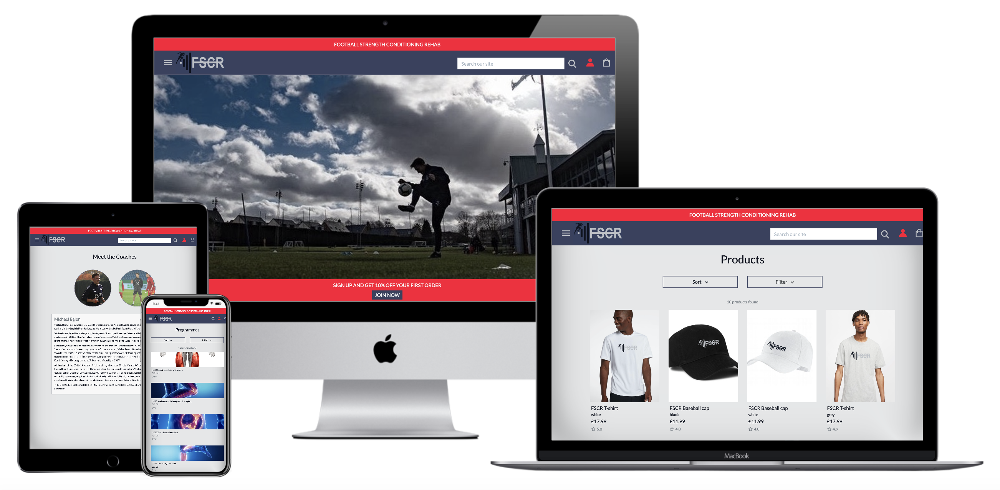
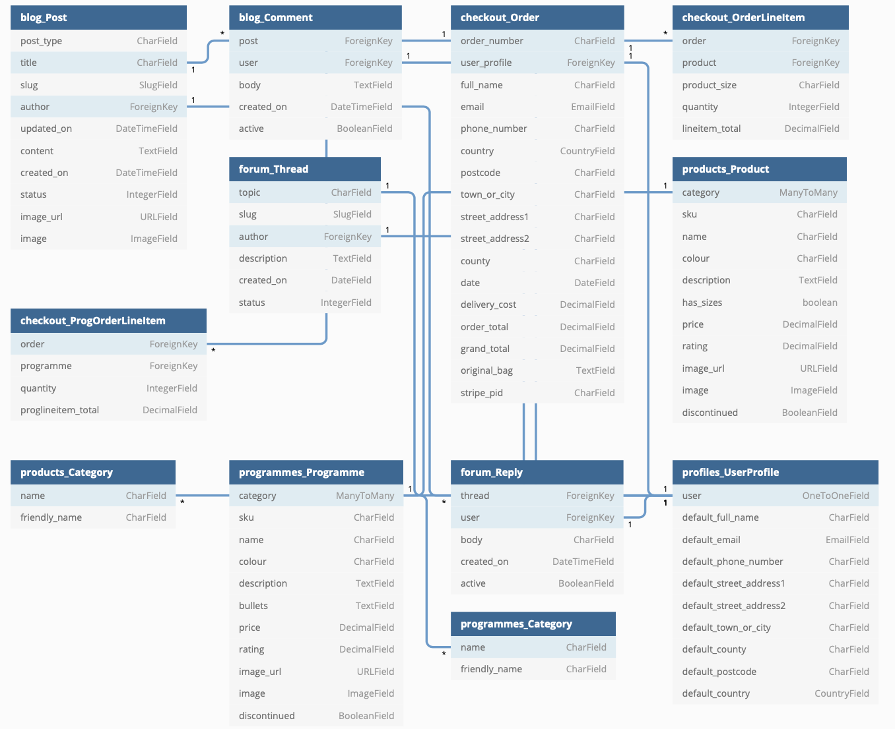
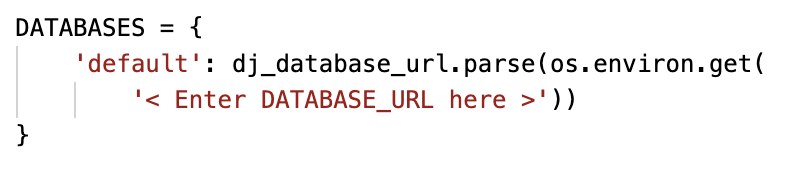
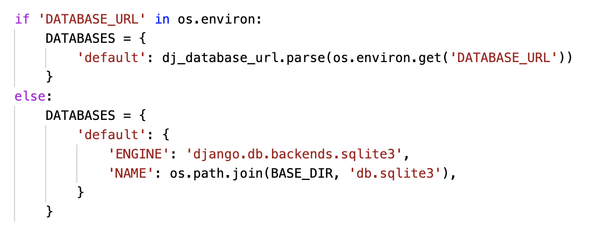
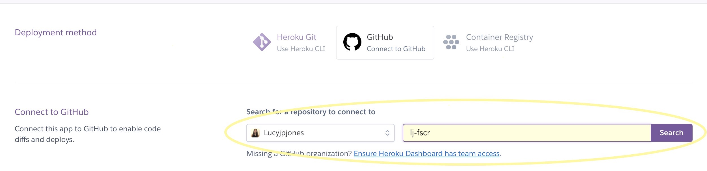

<div align="center">
  
<hr>

**FSCR (Football Strength Conditioning Rehab) focuses on providing structured and detailed fitness programmes for football-related injuries.**

This app was built using [GitHub](https://pages.github.com/) and deployed to [Heroku](https://www.heroku.com/).

[View Site](https://lj-fscr.herokuapp.com/)

</div>

For <ins>**testing**</ins> the following credentials can be used:

**Member Login**
- Username: fscruser
- Email: fscr@test.com
- Password: fscr1234

**Card payments**
- Card number: 4242 4242 4242 4242
- Zip & CCV: any integer values are valid

**<ins>Disclaimer</ins> : This project is for educational purposes only**
- Images taken from other sources will be replaced if the site goes commercial.
- Ratings and reviews are only mockups and will be removed or replaced if the site goes commercial.

---

## <ins>Table of contents</ins>

**<details><summary> User Experience (UX)</summary>**
  - [Purpose](#purpose)
  - [Design](#design)
  - [User stories](#user-stories)
  - [Database](#database)
  - [Data Schema](#data-schema)
  - [Wireframes](#wireframes)
</details>

**<details><summary> Features</summary>**
  - [Features used](#features-used)
  - [To do list](#to-do-list)
  - [Status](#status)
</details>

**<details><summary> Technologies</summary>**
  - [Languages](#languages)
  - [Frameworks, Libraries & Programs](#frameworks-libraries-programs)
</details>

**<details><summary> Deployment</summary>**
  - [Deploy to Heroku](#deploy-to-heroku)
  - [Deploy to AWS](#deploy-to-aws)
  - [Accessing code](#accessing-code)
</details>

**<details><summary> Testing</summary>**
  - [Testing Documentation](https://github.com/Lucyjpjones/lj-fscr/blob/master/testing.md)
</details>

**<details><summary> Credits</summary>**
  - [Content](#content)
  - [Media](#media)
  - [Acknowledgements](#acknowledgements)
</details>

**<details><summary> Contact</summary>**
  - [Contact details](#contact-details) 
</details>
---

# &rarr; **User Experience (UX)**

### **<ins>Purpose</ins>**

**FSCR** (Football Strength Conditioning Rehab) focuses on providing structured and detailed fitness programmes for football-related injuries. This is a full-stack site that has been created around business logic and used to control a centrally-owned dataset.

This application was built for a client who is currently looking to utilise their expertise in football rehabilitation by creating easy-to-follow fitness programmes. Rehabilitation after an injury can often be overlooked and my client is extremely passionate about ensuring athletes get the full recovery they need to get back to their sport and prevent further injury.

By completing this project I will have shown greater experience in HTML, CSS, and Javascript, and demonstrated my understanding of Python+Django. I will have also shown my competency in using a relational database, setting up an authentication mechanism, and providing payment transactions using stripe payments. 

### **<ins>Design</ins>**

**Structure**

- A simple design structure with a fixed navbar side navigation menu accessible from every page of the site. A brand logo is displayed in the top left of the screen to allow easy navigation back to the homepage.

- As well as including a page title on my base.html, I have also added the meta description tag to help optimize my click-through rate from search engine result pages.

**Colour scheme**

- After undergoing research into other fitness related sites and reviewing the [psychology behind colours](https://www.mypersonaltrainerwebsite.com/blog/how-to-use-color-psychology-to-create-the-perfect-fitness-website), I created my final palette using [Coolors](https://coolors.co).

> **Red:** Passion for the sport and a never-say-die attitude.

> **Blue:** Dependability, trust, and honesty

> **Grey:** paragraph Calmness and neutrality, focus, and precision.

> **Purple:** Overcoming physical challenges and limitations and setting farther more difficult goals.

<br>
  

- A lighter shade of the grey (#bdc1c750) featured in the palette above has been used as the main background colour throughout the site with a lighter shade (#f8f8f8) used for banners.
- #fafafa has been used for forms

**Typography**

- The font used throughout the site is 'Lato' which belongs to the sans-serif typeface family. The font is neutral and easily readable, making it a good choice for web design.

- Sans Serif as the fallback font if for any reason the font isn't being imported into the site correctly.

- Icons used throughout the site have been taken from [FontAwesome](https://fontawesome.com/) and [FlatIcon](https://www.flaticon.com/).

**Research**

- I spent some time researching other fitness and retail sites to gain inspiration and created a mood board with a collection of elements that caught my eye.


  

**Logo Design**

When it comes to creating a business, the logo is the central visual element in helping customers find, recognise, and remember a brand. Taking this into consideration, I decided to spend some time creating a logo for FSCR which would represent the brand well.

I set up a meeting with my client and presented them with a mood board of different designs and gathered their feedback.


My final design with client approval is displayed below;


**Favicon**

I created a personalised favicon for the site to add branding, and to make it easier for visitors to locate the page when they have multiple tabs open. I decided to keep the design simple and conventional by using only the first initial of the logo.


### **<ins>Database</ins>**

For this project I employed a [Relational Database](https://aws.amazon.com/relational-database/#:~:text=A%20relational%20database%20is%20a,be%20represented%20in%20the%20database.), to store my collection of data. I used [SQLite](https://www.sqlite.org/index.html) in development, as this is created by default, and [Heroku Postgres](https://www.heroku.com/postgres) in production. Relational databases were a suitable choice for this project as it allows multiple tables to be created, with data easily connected through the use of foreign keys. All Models included are related to at least one other Model, and implement common database relationships: many-to-one, many-to-many and one-to-one.

> **Note:** .sqlite3, my developmemt database file, was added to .gitignore before my initial commit to stop it being pushed to GitHub.

### **<ins>Data Schema</ins>**

To help visualize my database, I created a diagram using [dbdiagram](https://dbdiagram.io/) which illustrates the relationships between my models.



The `Product` model within the product's app, is used to store information about individual products.
The `Category` model within the product's app, is used to group products into specific categories.

The `Programme` model within the programme's app, is used to store information about individual programmes.
The `Category` model within the programme's app, is used to group programmes into specific categories.

The `UserProfile` model within the profiles app is used to store user's profile information and is connected to various models to fill other requirements;
- Checkout `Order` model - to store user's checkout information, as well as order history.
- Blog `Post` and `Comment` model - to store the name of the user who created the blog and those who have left a comment.
- Forum `Thread` and `Reply` model - to store the name of the user who created the thread and those who have replied.

The `Post` model within the blog app, is used to store posts added by the admin user.
The `Comment` model within the blog app, is used to store comments added by the user who is logged in.

The `Thread` model within the forum app, is used to store threads added by the user.
The `Reply` model within the forum app, is used to store replies made by the user logged in.

The `Order` model within the checkout app, is used to store orders.
The `OrderLineItem` model within the checkout app, is used to store information about individual products on the order.
The `ProgOrderLineItem` model within the checkout app, is used to store information about individual programmes on the order.

### **<ins>User Stories</ins>**

The basic page structure of my site is presented below;


> **Note:** Boxes highlighted are only accessible when a user is registered and logged in.

<ins>**User profiles**</ins>

**Site Visitor**
As a site visitor, I want to be able to easily navigate around the site and gain a clear insight into its purpose. I would like to be able to browse the services and products on offer with the option to purchase. I would also like the ability to contact the site owner if I require any further information and the option to register as a member for more resources.

**Site Member**
As a site member, I want to be part of a community where I can interact with other members around key topics to share each other's knowledge, experience, and progress. I would like to have my own user profile to store my personal details and order history, and the ability to easily log in and out of the site.

**Site Owner**
As the site owner, I want to be able to continually monitor and update the site to manage my user's expectations. I would like the ability to easily add, edit and delete products and programmes to ensure my site is always up to date and relevant, and add blogs for our site members. I want to provide a customer review option, to gain feedback for improvements, and to develop a sense of transparency to gain consumer loyalty and trust.

<ins>**User stories**</ins>

|                   | As a / an    | I want to be able to….                                              | So that I can…                                                                                       |
|--------------------------------|--------------|---------------------------------------------------------------------|------------------------------------------------------------------------------------------------------|
| Viewing and Navigation         |              |                                                                     |                                                                                                      |
| 1                              | Site Visitor | Discover FSCR’s purpose and goals                                   | Learn more about the brand and the coaches behind it                                                 |
| 2                              | Site Visitor | View a list of products                                             | Select a product to view more details                                                                |
| 3                              | Site Visitor | View a list of programmes                                           | Select a programme to view more details                                                              |
| 4                              | Site Visitor | View a specific category of products or programmes                                | Quickly find products I’m interested in without having to search through all the products            |
| 5                              | Site Visitor | View individual product details                                     | Identify the description, price, available sizes, product image, and rating                           |
| 6                              | Site Visitor | View individual programme details                                   | Identify the description, price, duration, rating, and reviews                                        |
| 7                              | Site Visitor | Easily access contact details                                       | Send a message regarding any queries I have                                                          |
| 8                              | Site Visitor | See reviews and ratings on products and programmes                  | Be reassured that the product/programme is good                                                      |
| 9                              | Site Member  | Browse associated blogs, articles, and recent new stories            | Learn more about football rehabilitation and keep up to date with news                               |
| 10                             | Site Member  | Access a member forum                                                               | Be part of a community and speak to other coaches/athletes                                           |
| Registration and user accounts |              |                                                                     |                                                                                                      |
| 11                             | Site Visitor | Easily register for an account                                      | Have a personal account and be able to view my profile                                               |
| 12                             | Site Visitor | Receive an email confirmation after registering                     | Verify that my account registration was successful                                                   |
| 13                             | Site Member  | Easily login or logout                                              | Access my personal account information                                                               |
| 14                             | Site Member  | Easily update my personal details                                   | Change my details if needed                                                                          |
| 15                             | Site Member  | Easily recover my password in case I forget it                      | Recover access to my account                                                                         |
| 16                             | Site Member  | Have a personalised user profile                                    | View my personal order confirmations, order history and save my payment details for future purchases |
| 17                             | Site Member  | Enable my details to be prefilled                                   | Save time entering my details when making future purchases                                          |
| Sorting and Searching          |              |                                                                     |                                                                                                      |
| 18                             | Site Visitor | Sort and filter the list of available products and programmes                    | Easily find the product/programme I’m looking for                                                              |
| 19                             | Site Visitor | Search the site by keywords                                         | Easily find what I am looking for                                                                    |
| 20                             | Site Visitor | Easily see what I’ve searched for and the number of results         | Quickly decide whether the product or programme I want is available                                  |                                                                                |
| Purchasing and checkout        |              |                                                                     |                                                                                                      |
| 21                             | Site Visitor | Easily select the size and quantity of a product when purchasing it | Ensure I don’t accidentally select the wrong product quantity or size                                |
| 22                             | Site Visitor | View items in my bag to be purchased                                | Identify the total cost of my purchase and all items I will receive                                  |
| 23                             | Site Visitor | Adjust the quantity of individual items in my bag                   | Easily make changes to my purchase before checkout                                                   |
| 24                             | Site Visitor | Easily enter my payment information and feel my personal and payment information is safe and secure                                  | Check out quickly with no hassles and confidently provide the needed information to make a purchase                   
| 25                             | Site Visitor | View an order confirmation after checkout                           | Verify that I haven’t made any mistakes                                                              |
| 26                             | Site Visitor | Receive an email confirmation after checking out                    | Keep the confirmation of what I’ve purchased for my records                                          |
| Admin and Store Management     |              |                                                                     |                                                                                                      |
| 27                             | Site Owner   | Add a product/programme                                                       | Add new product/programme lines to my products/programmes purchasing page                                                                                  |
| 28                             | Site Owner   | Edit/Update a product/programme                                               | Change product/programme prices, descriptions, images, and other details                              |
| 29                             | Site Owner   | Delete a product/programme                                                    | Remove items that are no longer available for sale                                                   |
| 30                             | Site Owner   | Add a blog                                                          | Add new blogs to share with site members                                                             |
| 31                             | Site Owner   | Links to FSCR social media platforms                                                          | To connect with our clients and strengthen consumer loyalty                                                             |

### **<ins>Wireframes</ins>**

As part of the design process, I created wireframes using [Balsamiq](https://balsamiq.com/). Creating these mock-ups helped me plan the basic structure and arrangement of the features for my site.

- [Homepage](readme/wireframes/wf-homepage.pdf)
- [Meet the Coaches](readme/wireframes/wf-meet-the-coaches.pdf)
- [Profile](readme/wireframes/wf-profile.pdf)
- [Products](readme/wireframes/wf-products.pdf)
- [Product View](readme/wireframes/wf-product-view.pdf)
- [Programmes](readme/wireframes/wf-programmes.pdf)
- [Programme View](readme/wireframes/wf-programme-view.pdf)
- [Shopping bag](readme/wireframes/wf-bag.pdf)
- [Checkout](readme/wireframes/wf-checkout.pdf)
- [Blog](readme/wireframes/wf-blog.pdf)
- [Blog View](readme/wireframes/wf-blog-view.pdf)
- [Forum](readme/wireframes/wf-forum.pdf)
- [Forum View](readme/wireframes/wf-forum-view.pdf)

#### Wireframes vs. Deployed site

The deployed site has some differences vs. the wireframes I initially created, the main discrepancies are highlighted below;

|   | Change                                        | Reason                                                                                                             |
|---|-----------------------------------------------|--------------------------------------------------------------------------------------------------------------------|
| 1 | Menu icon positioning                         | The menu is displayed on the left instead of the right, this was only changed for my own personal visual reasons   |
| 2 | Testimonial carousel repositioned on homepage | It wasn't visually pleasing to have two carousels on top of one another                                            |
| 3 | Latest blogs added to homepage                 | Client wanted this to be a focus on the homepage                                                                   |
| 4 | Contact form added to homepage                | This wasn't included on my wireframes but I added this to the bottom of my homepage which is a common positioning  |
| 5 | Removed red buttons                           | I decided not to use red buttons to avoid the possibility of user confusion                                        |
| 6 | 'Add to bag' and 'View more details' on programmes page | I decided not to have these buttons and to keep it in line with the structure of the product page by viewing on image click |
| 7 | Sample fitness plan removed from programme detail | Client didn't want to provide an example template so this was removed |
| 8 | View bag and checkout options available on 'add to bag' success toast | I decided to add both options so the user has the option to view their bag or just go straight to the checkout |
    
## [&#8679;](#table-of-contents)
---

## &rarr; **Features**

### **Features used**

<ins>**Structure and Navigation**</ins>

- **Responsive on all device sizes**
  - Mobile-first design, `responsive` on all devices through using the Bootstrap grid system and CSS media queries.

- **A user-friendly interface with easy navigation throughout the site**
  - Attractive, minimalistic design with visuals and information presented clearly and concisely.

  - Easily readable fonts and simple navigation throughout the site.
    - `Fixed navigation bar` visible on every page featuring a `dropdown` menu, easily `recognisable icons` and `brand logo` to link back to the homepage.
    - `Search bar` accessible from every page allowing the user to easily search the site by keywords. 
    - Clear interactive `buttons` used for an effortless user journey throughout the site.
    - `Toasts` used throughout the site to display alert messages to the user to assist on their journey.
    - An aesthetically pleasing custom `404 page` if the user is directed to a non-existent page. 

<ins>**Home**</ins>

- **Home**
    - A `carousel` with automatic rotation has been used for the callout banner and to display athlete testimonials.
    - `Card listings` have been used to display links to programmes/products page, and to display the latest blogs.
    - A contact `form` has been added using EmailJS to allow the user to easily get in contact with the site owner.

- **Meet the Coaches**
    - Navigation `pills` have been used to allow the user to switch between each individual by an image click.

<ins>**Products**</ins>

- **Products**
    - `sort and filter` functionality to allow users to easily find products they are looking for.
    - `Card listings` have been used to display product image, name, colour price and rating.
- **Product Detail**
    - `crispy forms` used for elegant formatting.
    - `Size selector` option for sized products to allow user to select a size.
    - `Quantity selector` option to allow user to select a quantity.
    - `add to bag` button to allow user to add the product to bag.
- **Product Admin**
    - `Forms` have been used to allow the admin user to add and edit products manually on the site.

<ins>**Programmes**</ins>

- **Programmes**
    - `sort and filter` functionality to allow users to easily find programmes they are looking for.
    - `Card listings` have been used to display programme image, name, price and rating.
- **Programme Detail**
    - `crispy forms` used for elegant formatting.
    - A `carousel` has been used to display programme customer reviews.
    - `Quantity selector` option to allow user to select a quantity.
    - `add to bag` button to allow user to add the product to bag.
- **Programme Admin**
    - `Forms` have been used to allow the admin user to add and edit programmes manually on the site.

<ins>**Bag**</ins>

- **Bag**
  - A fully functioning shopping bag allowing users to add both products and programmes they wish to buy
  - `Quantity selector` with option to update or remove item from bag
  - Clear `Secure Checkout` button to take user to checkout
  - An `arrow` displayed at the bottom of the bag to easily direct the user back to the navigation options

<ins>**Checkout**</ins>

- **Checkout:**
    - A order summary displaying all the items the user has in their bag ready to purchase.
    - `crispy forms` used for elegant formatting.
    - `Forms` used to display personal, delivery and payment fields.
    - Option for user to click 'Save this delivery information to my profile' to save details to their profile page.
    - `Stripe payments` used to manage site card transactions.

- **Checkout Success**
    - The checkout success page provides reassurance for the user that their purchase has gone through and displays all their order details. 
    - Order confirmation sent to the user's personal email after they complete checkout.

<ins>**Blog**</ins>

- **Blog**
    - `sort and filter` functionality to allow users to easily find posts they are looking for.
    - `Card listings` have been used to display post image, title, author and date.

- **Post Detail**
    - `Forms` used for posting user comments.
    - `crispy forms` used for elegant formatting.
    - `Collapse` toggle used to display and hide blog references.
    - `trash icon` with delete functionality used for deleting own comments.

<ins>**Forum**</ins>

- **Forum:**
    An interactive message board allowing users to add their own threads and comment on others.
    - A `table` has been used to display all the threads posted in the forum. Details include thread topic, number of replies, author and the date created.
    - `Forms` have been used to allow the logged in user to add their own thread.

- **Thread Detail**
    - `Forms` used for posting user replies.
    - `crispy forms` used for elegant formatting.
    - `trash icon` with delete functionality used for deleting own replies.
    - `Edit icon` with link to prefilled `Form` to allow users to edit their own threads.

<ins>**Profiles**</ins>

- **Profile**
    - `crispy forms` used for elegant formatting.
    - `Forms` used to display users personal details.
    - Option for user to click 'update details' to save details to profile.
    - A `table` has been used to display the user's order history including order number, order date and order total. There is also a button 'view order details' which links to the checkout success page showing the specific order details.

<ins>**Authorisation**</ins>

All authorisation pages including register, login and logout have been implemented through Django allauth account. CSS styling has been applied to ensure pages match the sites overall design spec.
- `Social login` has been implemented through Django allauth socialaccount giving the user the option to login through Google, Facebook or Twitter.

### **To do list**

#### Status

> Project is: <ins>ongoing</ins>

I will continue to update my website to meet my clients' expectations. I have further development plans which I have listed below.

**Future Development plans**
- Add more payment options for my users, including apple pay to improve user experience with quicker checkout.
- Ability for user to autofill address at checkout by entering a postcode.
- 'Add a review' option for members to give their opinion on the products and programmes they have purchased.
- Add a count onto the bag icon so users can easily identify how many items are in their bag.
- More queries added to search functionality for more effective search results.
- Add video blogs to blog (already included in the filter but currently no video posts provided by client).

## [&#8679;](#table-of-contents)
---

## &rarr; **Technologies**

#### Languages

- [HTML5](https://en.wikipedia.org/wiki/HTML5)
- [CSS3](https://en.wikipedia.org/wiki/Cascading_Style_Sheets)
- [JavaScript](https://www.javascript.com/)
- [Python](https://www.python.org/)

#### Frameworks, Libraries & Programs

- [**Django**](https://www.djangoproject.com/)
  - Python Web framework used to build the site.

- [**Git**](https://git-scm.com/)
  - Git was used for version control by utilizing the Gitpod terminal to commit to Git and push to GitHub.

- [**GitHub**](https://github.com/)
  - GitHub is used to store the project code after being pushed from Git.

- [**Heroku**](https://www.heroku.com/)
  - Heroku is the app platform I deployed my project to.

- [**Heroku Postgres**](https://www.heroku.com/postgres)
  - Heroku’s reliable and powerful database used to store the data for my deployed Heroku App.

- [**jQuery:**](https://jquery.com/)
  - A javascript library used to simplify DOM manipulation.

- [**Bootstrap 4.5.3**](https://getbootstrap.com/)
  - Bootstrap was used to assist with the responsiveness and styling of the website using design templates.

- [**Boto3**](https://boto3.amazonaws.com/v1/documentation/api/latest/index.html)
    - Python SDK for AWS, used to directly create, update, and delete AWS resources from my Python scripts.

- [**gunicorn**](https://gunicorn.org/)
   - WSGI server used to take care of everything happening between the web server and web application.

- [**pillow**](https://pypi.org/project/Pillow/2.2.1/)
    - Python Imaging Library (PIL), used to add support for opening, manipulating, and saving images.

- [**psycopg2**](https://pypi.org/project/psycopg2/)
    - PostgreSQL database adapter

- [**AWS**](https://aws.amazon.com/)
  - A cloud-based storage service used to store static and, media files.

- [**Stripe**](https://stripe.com/gb)
  - Stripe was used to deal with payments.

- [**Emailjs**](https://www.emailjs.com/)
  - Used to send emails directly from a from to my Gmail account.

- [**Temp Mail**](https://temp-mail.org/en/)
  - Temp Mail was used to provide temporary, secure, anonymous, free, disposable email addresses for testing purposes.

- [**Google fonts**](https://fonts.google.com/)
  - Google fonts were used to import the fonts into the CSS file which is used on all pages throughout the project.

- [**Font Awesome 4.7.0**](https://fontawesome.com/)
  - Font Awesome was used to add icons for aesthetic and UX purposes.

- [**Flaticon**](https://www.flaticon.com/)
  - Provided icons throughout site.

- [**Balsamiq**](https://balsamiq.com/)
  - Balsamiq was used to create the wireframes during the design process.

- [**Grammarly**](https://www.grammarly.com/)
  - Grammarly was used to ensure any grammar errors are eliminated.

- [**HTML Formatter**](https://www.freeformatter.com/html-formatter.html) and [**CSS Formatter**](https://www.freeformatter.com/css-beautifier.html)
  - Used to format my HTML and CSS files with the desired indentation level for optimal readability.

- [**W3 Validator**](https://validator.w3.org/#validate_by_input) and [**W3C CSS Validator**](https://jigsaw.w3.org/css-validator/#validate_by_input)
  - Used to validate my HTML and CSS files

- [**JShint**](https://jshint.com)
    - Used to validate JS code

- [**PEP8 online**](http://pep8online.com)
    - Used to check code for PEP8 requirements.

- [**Tables Generator**](https://www.tablesgenerator.com/markdown_tables)
  - Used to create tables in my readme file.

- [**Favicon**](https://favicon.io/)
    - Used to create a favicon, displaying my logo on a web browser next to the web address bar, the browser tab, and the bookmarks bar.

- [**Techsini**](http://techsini.com/multi-mockup/index.php)
    - Multi Device Website Mockup Generator Tool

## [&#8679;](#table-of-contents)
---

## &rarr; **Deployment**

#### Deploy to Heroku

The project was deployed to Heroku with all static and media files stored on Amazon S3. I also set up automatic deployment to ensure my Heroku app was always up to date with my GitPod repository.

> **Note:** As all static and media files were stored in an AWS bucket these are not available through the GitHub repository. Please contact the site owner if you wish to use any of the images included.

This project also requires a `Gmail Account` with an app secret password, to allow emails to be sent to users. Sign up for a Gmail account [here](https://accounts.google.com/signup/v2/webcreateaccount?hl=en&flowName=GlifWebSignIn&flowEntry=SignUp)

If you would like to add the Django allauth `Social Account Login` feature to your site they're many useful online guides to help you get set up. The list of social providers can be found [here](https://django-allauth.readthedocs.io/en/latest/providers.html)

If you would like to add the `Stripe Payments` feature to your site, the Stripe documentation can be found [here](https://stripe.com/docs)

> **Note:** In the following documentation, all environment variables are included, assuming that you are implementing all the sites features. If you are not using certain aspects, these variables can be excluded.
<p>

<details>
<summary>Deploying to Heroku</summary>
<p>

> **Note:** Before following the below steps ensure you have already created your new repo in Github.

1. Log in (or Register) to [Heroku](https://www.heroku.com/) and from your dashboard click 'new' > 'create new app'.

   

2. Enter your 'App name' and choose the appropriate region, then click 'Create app'.
   > **Note:** 
 The app name must be unique, all lowercase, and '-' to be used instead of spaces.
The region chosen should be the one closest to you.

   

3. Then on the 'Resources' tab, search and add on the Heroku Postgres database.

4. To use Postgres, install dj_database_url, and psycopg2 in the project terminal using the following commands;

    `$ pip3 install dj_database_url`

    `$ pip3 install psycopg2`

5. Freeze the requirements to ensure Heroku installs all the apps requirements when deployed using the following command;

    `$ pip3 freeze > requirements.txt`

6. To migrate to the postgres, go to settings.py and add the following import;

    `import dj_database_url`

   Then down in the databases setting comment out the default configuration and replace the default database with a call to dj_database_url.parse and give it the database URL from Heroku.

   

    > **Note:** You can either get the database URL from your config variables in your app settings tab or from the command line by typing Heroku config.

7. Apply all migrations using the following command;

    `$ python3 manage.py migrate`

    After migrations have been applied amend your database configurations to;

    

     > **Note:** This will ensure that your Postgres database is used in deployment and your sqlite3 in development.
    
    Your database should now be all set up.

8. Create a superuser to log in with using the following command;

    `$ python3 manage.py createsuperuser`


9. Go to the Settings tab on Heroku, scroll to the 'Config Vars' section, and click 'Reveal Config Vars'. 

   

   Enter the variables (key and value) contained in your environment settings or stored in an env.py. The keys are listed below and values are inputted by the user.

| Key               | Value               |
|-------------------|---------------------|
| AWS_ACCESS_KEY_ID | To be added by user |
| AWS_SECRET_KEY_ID | To be added by user |
| USE_AWS           |        TRUE         |
| DATABASE_URL      | To be added by user |
| EMAIL_HOST_PASS   | To be added by user |
| EMAIL_HOST_USER   | To be added by user |
| SECRET_KEY        | To be added by user |
| STRIPE_PUBLIC_KEY | To be added by user |
| STRIPE_SECRET_KEY | To be added by user |
| STRIPE_WH_SECRET  | To be added by user |

10. Install gunicorn using the following command;

    `$ pip3 install gunicorn`

    Then freeze into your requirements file.

11. Create a Procfile and add the following line;

    `web: gunicorn lj_fscr.wsgi:application`

    This tells Heroku to create a web dyno which will run gunicorn and serve the Django app.

    > **Note:** The **P**rocfile must be assigned a capital P.

12. Last, you need to temporarily disable collectstatic to ensure that Heroku won't try to collect static files when we deploy. This is done by adding the below variable;

    | DISABLE_COLLECTSTATIC  | 1 |

13. Add the hostname of your Heroku app to allowed hosts in settings.py

14. Now you can commit all the changes and push to GitHub;

    `$ git add .`
    `$ git commit -m <'your commit message'>`
    `$ git push`

    If you created your app on the website you will need to initialize your Heroku git remote using the following command;

    `$ heroku git:remote -a lj-fscr`

    Then use the following command to push to Heroku;

    `$ git push heroku master`

</p>
</details>

<details>
<summary>Deploying AWS Static and Media files</summary>
<p>

The project used Amazon Web Services s3, which is a cloud-based storage service, to store static and media files.

1. Create an account by navigating to [aws.amazon.com](https://aws.amazon.com/) and clicking create an AWS account. Fill in your email and password, and a username for your account, and select continue.

2. Now on the account type page, select personal and fill out the required information, click create an account and continue.

3. Next you will be asked to enter a credit card number which will be used for billing if we go above the free usage limits. Beyond this, you'll be asked a couple more verification questions then once all required information is confirmed your account will be created.

   > **Note**: For this project, I didn't go anywhere near the usage limits but keep in mind that AWS is not free if you go above the free usage limits.

4. Now you can navigate back to [aws.amazon.com](https://aws.amazon.com/) and sign-in to your account.

5. Navigate to AWS management console under my account and using the 'find services' search bar, find s3.

6. Now open s3 and create a new bucket to store all your files.

- Enter a name for your bucket
    > **Note**: I'd recommend naming your bucket to match your Heroku app name.

- Select a region
    > **Note**: Select the region closest to you like you did when creating your Heroku app.

- Uncheck block all public access and acknowledge that the bucket will be public.
    > **Note**: Allows public access to our static files.

- Click create bucket and your bucket should be created.

7. Now click into your new bucket and set some settings;

- On the properties tab and turn on static website hosting.

    > **Note**: For the index and error document, just fill in some default values.

- On the permissions tab 

  - Paste in a **CORS Configuration** to set up the required access between your Heroku app and this s3 bucket. Copy the code below supplied by CodeInstitute;

        [
        {
            "AllowedHeaders": [
                "Authorization"
            ],
            "AllowedMethods": [
                "GET"
            ],
            "AllowedOrigins": [
                "*"
            ],
            "ExposeHeaders": []
        }
        ]

  - In the **Bucket Policy** tab, select policy generator
    - Policy type is 's3 bucket policy'
    - Allow all principles using a *
    - Actions is 'GetObject'
    - Add in your ARN (found on previous page)
    - Click 'Add statement' then 'Generate policy'
    - Copy the policy code and paste it into the bucket policy editor

       > **Note:** To allow access to all resources in this bucket add a slash star onto the end of the resource key.
    
    - Click save

  - In the **Access Control List** tab, under the Public Access section, set the list objects permission to everyone.

8. Create a user to access the bucket created.

- Search for a new service 'IAM'
- Now open IAM, navigate to 'groups' and click 'Create new group'

  > **Note:** You can call your group whatever you want but try to give it a name that makes sense to you for what it is.

- Create a policy by navigating to 'policies' and click 'Create policy'
- Go JSON tab and click 'import managed policy'
  - Search for s3 and then import the s3 full access policy.
    - Replace resource value '*' with your bucket ARN from the bucket policy page;

    "Resource": [
        "arn:aws:s3:::lj-fscr",
        "arn:aws:s3:::lj-fscr/*"
    ]

  - Click 'Review policy', give it a name and a description and click 'Create policy'

9. Attach the policy to the group you created.
- Navigate to 'groups', select the group you created and on permissions tab select 'Attach policy'.
- Search for the policy you created, select it and click 'Attach policy'.

- Now to create the user, navagate to 'users' and click 'Add user'
  - Add username, select programmatic access and click 'Next'
  - Add user to a group by selecting the group you created and click 'Next' then click through to the end and click 'Create user'
  - Now download the CSV file which will contain this users access key and secret access key

    > **Note:** It's very important you download and save this CSV because once you've gone through this process we can't download them again.

10. To connect to Django, head to your project and install two new packages then freeze them into your requirements.txt;
  - $ pip3 install boto3
  - $ pip3 install django-storages
  - $ pip3 freeze > requirements.txt

11. In settings, add 'storages' to installed apps.

12. To connect Jdango to s3 add the below settings in settings.py which will tell it which bucket it should be communicating with;

        if 'USE_AWS' in os.environ:
            AWS_STORAGE_BUCKET_NAME = 'lj-fscr'
            AWS_S3_REGION_NAME = 'eu-west-2'
            AWS_ACCESS_KEY_ID = os.environ.get('AWS_ACCESS_KEY_ID')
            AWS_SECRET_ACCESS_KEY = os.environ.get('AWS_SECRET_ACCESS_KEY')
            AWS_S3_CUSTOM_DOMAIN = f'{AWS_STORAGE_BUCKET_NAME}.s3.amazonaws.com'


13. Create a file called custom_storages.py and add the content below;

        from django.conf import settings
        from storages.backends.s3boto3 import S3Boto3Storage


        class StaticStorage(S3Boto3Storage):
            location = settings.STATICFILES_LOCATION


        class MediaStorage(S3Boto3Storage):
            location = settings.MEDIAFILES_LOCATION

    Then in settings.py add the below:

        STATICFILES_STORAGE = 'custom_storages.StaticStorage'
        STATICFILES_LOCATION = 'static'
        DEFAULT_FILE_STORAGE = 'custom_storages.MediaStorage'
        MEDIAFILES_LOCATION = 'media'

        STATIC_URL = f'https://{AWS_S3_CUSTOM_DOMAIN}/{STATICFILES_LOCATION}/'
        MEDIA_URL = f'https://{AWS_S3_CUSTOM_DOMAIN}/{MEDIAFILES_LOCATION}/'
</p>
</details>

<details>
<summary>Setting up Automatic Deployment to Heroku</summary>
<p>

1. From the Heroku deploy tab, select the Deployment method 'GitHub'.

    

2. On the 'Connect to GitHub' section make sure your GitHub profile is displayed then add your repository name and click 'Search'.

    > **Note:** This is the name of your repo in GitHub. It is good practice to use an identical name for your Heroku app.

    

3. Your repo should now be displayed below, click 'Connect' to connect to this app.

4. Go to the Deploy tab on Heroku and under the Automatic deployment section, click 'Enable Automatic Deploys'. Then under Manual deploy click 'Deploy Branch'.

   

   - Heroku will now receive the code from GitHub and start building the app using the required packages.
   - Once built you will receive the message 'Your app was successfully deployed' and you can click 'View' to launch your new app.

        > **Note:** 
        In Manual deploy dropdown 'master' is selected'

</details>

`Sensitive data` for your project can either be stored in your environment settings or be added to an env.py file in your workspace.

<details>
<summary>More details on creating an env.py file</summary> 
<p>

1. Add a env.py file to store environment variables:

    `os.environ.setdefault("Key", "Value")`


| Key               | Value               |
|-------------------|---------------------|
| AWS_ACCESS_KEY_ID | To be added by user |
| AWS_SECRET_KEY_ID | To be added by user |
| DATABASE_URL      | To be added by user |
| EMAIL_HOST_PASS   | To be added by user |
| EMAIL_HOST_USER   | To be added by user |
| SECRET_KEY        | To be added by user |
| STRIPE_PUBLIC_KEY | To be added by user |
| STRIPE_SECRET_KEY | To be added by user |
| STRIPE_WH_SECRET  | To be added by user |

 2. Add env.py to your .gitignore file to ensure this file is never pushed to GitHub.
    > **Note:** The env.py mustn't be tracked as any GitHub user can access your confidential data.

</p>
</details>

#### Accessing code

Forking allows you to create a copy of the original repository and propose changes to the repository owner via a pull request.

<details>
<summary>Forking the GitHub Repository</summary>
<p>

1. Log in to GitHub and locate the GitHub Repository.
    
    FSCR repository can be found [here](https://github.com/Lucyjpjones/lj-fscr/)

2. At the top of the Repository (not top of page) just above the "Settings" button on the menu, locate the "Fork" button.

     

3. You should now have a copy of the original repository in your GitHub account.

</p>
</details>

When you clone a repository, the repository is copied on to your local machine, allowing you to use the project as a starting point for your own idea.

<details>
<summary>Making a Local Clone</summary>
<p>

1. Log in to GitHub and locate the GitHub Repository.
   
   FSCR repository can be found [here](https://github.com/Lucyjpjones/lj-fscr/)

2. Under the repository name, click the "download code" option.

   

3. To clone the repository using HTTPS, under "Clone with HTTPS", copy the link.

   

4. Open Git Bash

5. Change the current working directory to the location where you want the cloned directory to be made.

6. Type git clone, and then paste the URL you copied in Step 3.

    ```
    $ git clone https://github.com/YOUR-USERNAME/lj-fscr.git
    ```

7. Press Enter. Your local clone will be created.

    ```
    $ git clone https://github.com/YOUR-USERNAME/lj-fscr.git

    > Cloning into `lj-fscr`...
    > remote: Enumerating objects: 299, done.
    > remote: Counting objects: 100%, (299/299),  done.
    > remote: Compressing objects: 100% (156/156), done.
    > Receiving objects: remove: Total 299 (delta 145), reused 267 (delta 126), pack-reused 0
    > Receiving objects: 100% (299/299), 4.61MiB | 2.98 MiB/s, done.
    > Resolving deltas: 100% (145/145), done. Unpacking objects: 100% (10/10), done.
    ```

    Now, you have a local copy of your fork of the FSCR repository.

    > **Note:** The repository name and output numbers that you see on your computer, representing the total file size, etc, may differ from the example I have provided above.

8. Either store your sensitive data in your environment settings or add an env.py file to your workspace (More details above).

   > **Note:** Contact the site owner if you want more information on the environment variables that have been included.

9. Install all requirements using the following command;

    `$ pip3 install -r requirements.txt`

10. Apply all migrations using the following command;

    `$ python3 manage.py migrate`
    
    Your database should now be all set up.

11. Create a superuser to log in with using the following command;

    `$ python3 manage.py createsuperuser`

12. You can now run your project locally using the following command;

    `$ python3 manage.py runserver`

</p>
</details>

## [&#8679;](#table-of-contents)
---

## &rarr; **Credits**

#### Content

- Materials supplied by [Code Institute](https://docs.djangoproject.com/en/3.1/) for project Boutique Ado.

- [Django documentation](https://docs.djangoproject.com/en/3.1/)

- [Code](https://djangocentral.com/building-a-blog-application-with-django/) used to help create a blog and forum app

- [Code](https://bootstrapious.com/p/bootstrap-sidebar) used to help create sidenav

- [Code](https://learndjango.com/tutorials/django-allauth-tutorial) used to help with implementing Social login's

- [Code](https://stackoverflow.com/questions/31643670/link-a-div-in-another-page-in-url-with-an-anchor-tag-django) used to help with linking to id on a different page using Django

- [Site](https://www.remove.bg/upload) used to remove background from logo

- [Site](https://pinetools.com/colorize-image) used to change the colour of the image for logo design

- [Stack overflow](https://stackoverflow.com/):
  - [Code](https://stackoverflow.com/questions/43816377/add-body-overlay-when-a-sidebar-menu-opens/43816724) help for adding body overlay when a sidebar is open
  - [Code](https://stackoverflow.com/questions/25385289/how-to-set-the-size-of-a-column-in-a-bootstrap-responsive-table/25385798) help with setting the size of the column width in bootstrap
  - [Code](https://stackoverflow.com/questions/11472495/remove-labels-in-a-django-crispy-forms) help with removing labels from crispy forms
  - [Code](https://stackoverflow.com/questions/38684753/django-reducing-the-size-of-input-box-in-crispy-forms) help with reducing the inbox size in crispy forms
  - [Code](https://stackoverflow.com/questions/45847278/django-use-slugify-for-detail-url) help using slugify for detailed urls
  - [Code](https://stackoverflow.com/questions/43879330/djangounable-to-compare-the-logged-in-user-with-the-author-of-the-post)help with IF statement for logged in user
  - [Code](https://stackoverflow.com/questions/431628/how-to-combine-two-or-more-querysets-in-a-django-view) help to combine my querysets for search bar functionality

#### Media

- General site content provided by the client
- Images used for callout image, about page and profile images provided by the client
    - Main callout image appears blurry on larger devices, the client will provide an alternative image before the site goes commercial
- Blog content written by the client with all references included
- Product images were taken from [ASOS](https://www.asos.com/) and [Nike](https://www.nike.com/gb/) and edited for personal use
- Programme images were taken from;
    - [Groin Injury](https://www.therapeuticassociates.com/i-pulled-my-groin-heard-it-pop-do-i-need-physical-therapy/)
    - [Tendinopathy Management ](https://myalliedpain.com/knee-pain-and-injuries)
    - [Quadricep Injury](https://glebephysiotherapy.com.au/service/physiotherapy-for-front-of-thigh-quads-pain/)
    - [Individual Performance](https://hypnosisdenvercolorado.com/2013/09/24/hypnosis-denver-smoking-affects-performance/)
    - [Core Strength](http://fitness44muscle.blogspot.com/2014/09/Body-facts-the-abdominal-muscles-and-their-function.html)
    - [Calf Injury](https://www.shutterstock.com/video/clip-11108528-gastrocnemius---leg-muscles-anatomy-animation)
    - [Hamstring Injury](https://fitforfutbol.com/2018/09/brilliant-hamstring-injury-observations-from-dave-joyce/)
    - [Off-feet Conditioning](https://www.newsweek.com/online-heart-health-calculator-can-help-predict-risk-dying-cardiovascular-1032247)

#### Acknowledgments

- My Mentor, Aaron for his continuous help and support throughout the project.

- The help and support received from the tutors at [Code Institute](https://codeinstitute.net/).

- The [Code Institute](https://codeinstitute.net/) Slack Community.
    - @Clint, for helping me to solve the issue on limiting quantity added in shopping bag

- Friends & Family for continuous feedback and support.

## [&#8679;](#table-of-contents)
---

## &rarr; **Contact**

#### Contact details

Created by @lucyjpjones

If you have any problems, questions or, suggestions for my project please contact me on the email below:

```
lucyjpjones@gmail.com
```

Thanks for visiting.

&copy;
LucyJPJones