## &rarr; **Testing**

**

 Testing Documentation
**
  - [Testing user stories](#testing-user-stories)
  - [Manual function testing](#manual-function-testing)
  - [Automated testing](#automated-testing)
  - [Validator checks](#validator-checks)
  - [Audits](#audits)
  - [Responsive Design](#responsive-design)
  - [Additional Testing](#additional-testing)
  - [Bugs](#bugs)

---

### **Testing user stories**

<u>Viewing and Navigation</u>

**1. Discover FSCR’s purpose and goals**

I created an 'about' and 'meet the coaches' page so any site visitor can learn about the brand and the coaches behind it. Both pages are easily accessible via the main nav menu.

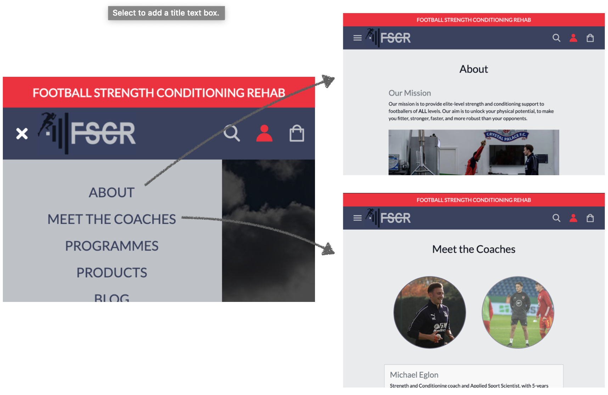

**2. View a list of products**

I created a 'products' page including a list of all products, displaying product image, name and price, with the option to select an individual card for more details.

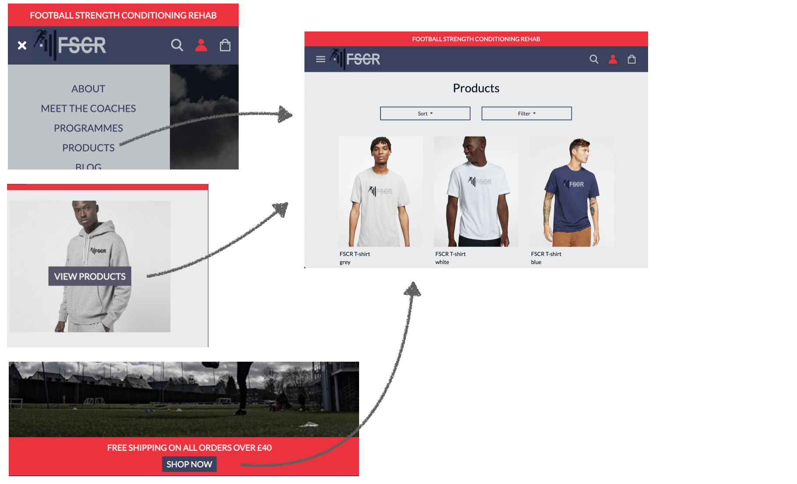

**3. View a list of programmes**

I created a 'programmes' page including a list of all programmes, displaying product image, name and price, with the option to select an individual card for more details.

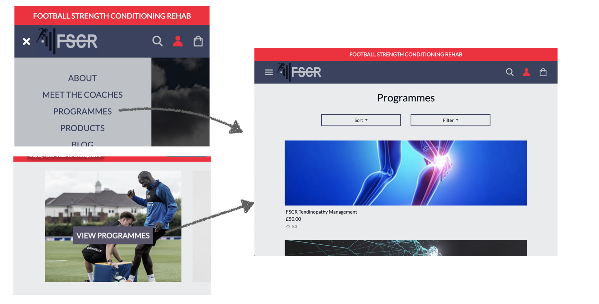

**4. View a specific category of products or programmes**

I added a sort and filter option to both the products and programmes page. Users have the ability to sort alphabetically, by price or by highest rated. They also have the option to filter by a specific category to allow them to quickly find what they are searching for.

**5. View individual product details**

Each individual product page displays the products description, price, available sizes, product image and rating. There is also the ability to add to bag or redirect back to the products page.

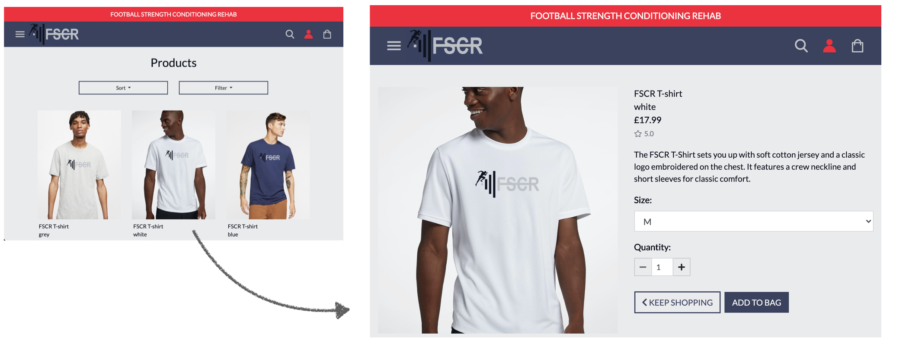

**6. View individual programme details**

Each individual programme page displays the programmes description, price, available sizes, programme image and rating. There is also the ability to add to bag or redirect back to the programmes page.

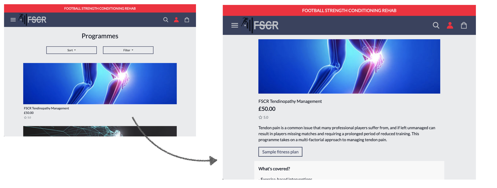

**7. Easily access contact details**

I have included a contact form on the home page which is also easily navigated to via the main nav menu. This has been set up using EmailJS with my own custom template to assist with organisation of user enquiries.

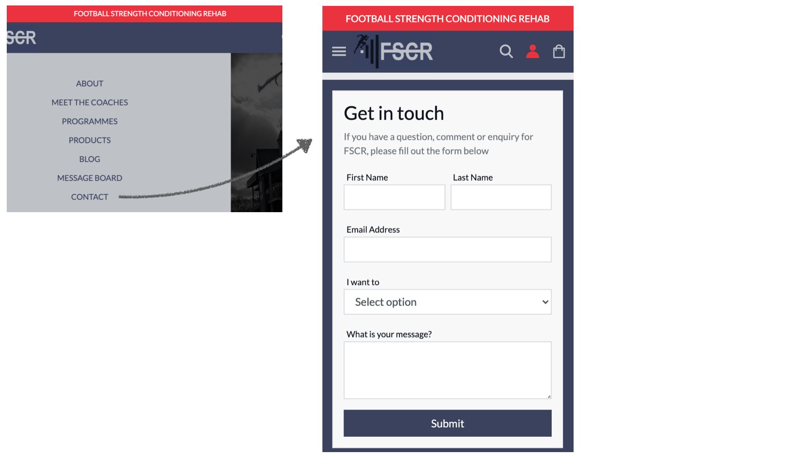

**8. Browse associated blogs, articles and recent new stories**

I created a blog app that can only be viewed by site members. When a user is not logged in and they click on the blog they will be directed to the login/register page. If a user is a member and logged in they will be directed to the blog page where they can view blogs posted by the admin user. Members also have the ability to comment on blog posts creating further user interaction.

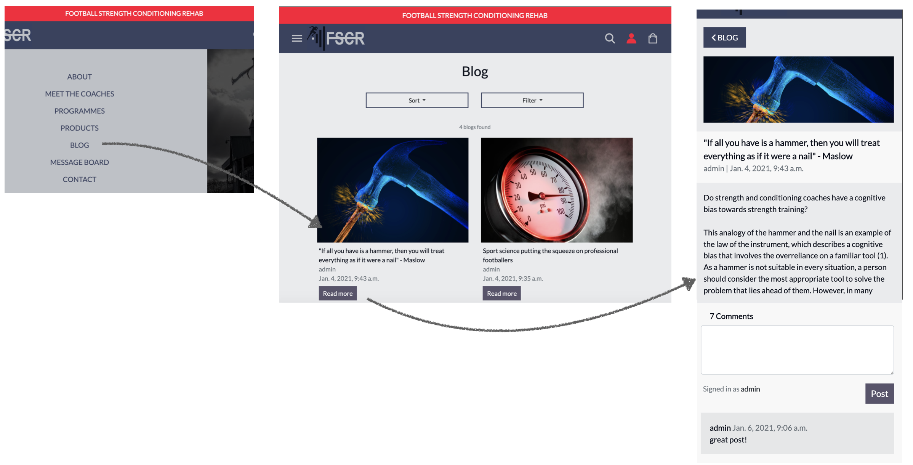

**9. Access a member forum**

I created a forum app that can only be accessed by site members. When a user is not logged in and they click on the forum they will be directed to the login/register page. If a user is a member and logged in they will be directed to the forum page where they will have the option to view threads by other users and add their own. They also have the capability of adding a message to any thread which displays both their logged in username and date/time posted.

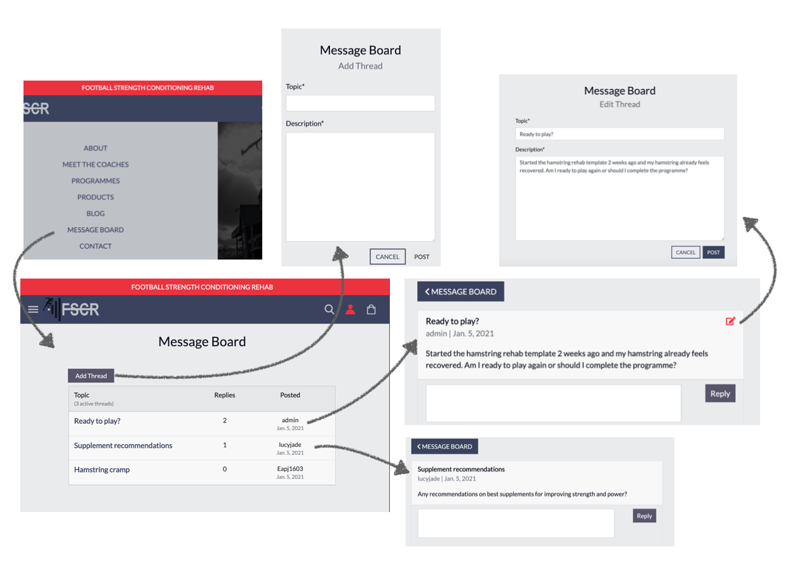

<u>Registration and user accounts</u>

**10. Easily register for an account**

A fully functioning register page where a user is able to enter their details to create an account. The user can access this page by clicking on the recognisable user icon and selecting 'register'.

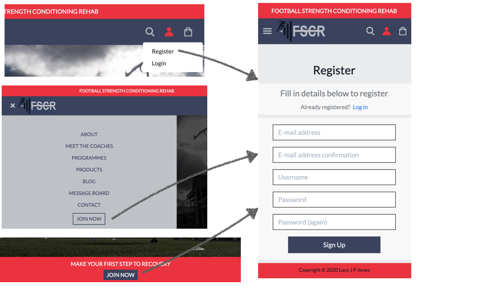

**11. Receive an email confirmation after registering**

After registering the user is directed to a registration success page where they are informed that they will receive an email to validate their email address and complete registration.

**12. Easily login or logout**

When a user is registered they have the ability to easily log into their account. The user can click on the profile icon, then select log in and enter their details to sign into their account. Once logged in the user will be able to log out via the profile icon.

I also decided to add social logins to allow my user to log in more quickly. The user can choose their preferred platform (Facebook, Google or Twitter) and follow the authorisation for the specified site. (Facebook screenshots included below).

**13. Easily update my personal details**

Each registered user has their own profile page where they can store their personal details including name, email and delivery details. This information can be easily updated by filling in any field and then clicking 'update details'.

**14. Easily recover my password in case I forget it**

If a user forgets their password they have the option to click the 'forgot password' link. This will direct them to another page which will inform the user that an email has been sent to them to recover their password.

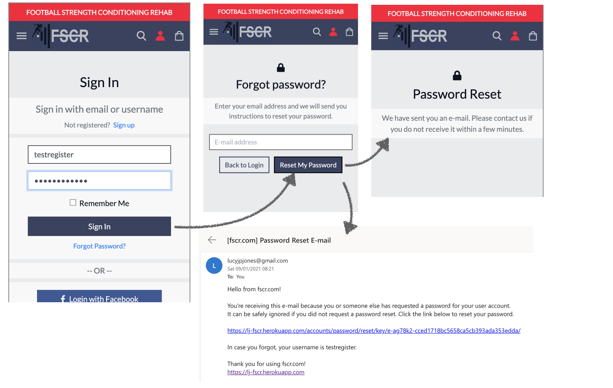

**15. Have a personalised user profile**

The profile page is specific to each user with a personalised username greeting,the option to save their own entered details and a log of their order history.

**16. Enable my details to be prefilled**

If the user has filled in their profile information, these details will be prefilled at checkout. The user also has the option to tick the save details options on checkout which will automatically save details to their profile page.

<u>Sorting and Searching</u>

**17. Sort and filter the list of available products and programmes**

I have added a sort and filter option to the products and programmes page to allow a user to easily find what they are looking for. I also decided to add this function to the blog page as I think it will be useful to the user as more blogs get posted over time.

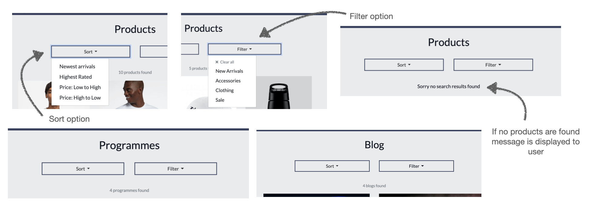

**18. Search the site by keywords**

A search bar features in the main site header. Users can search by keywords on the product and programme page to filter by specific items.

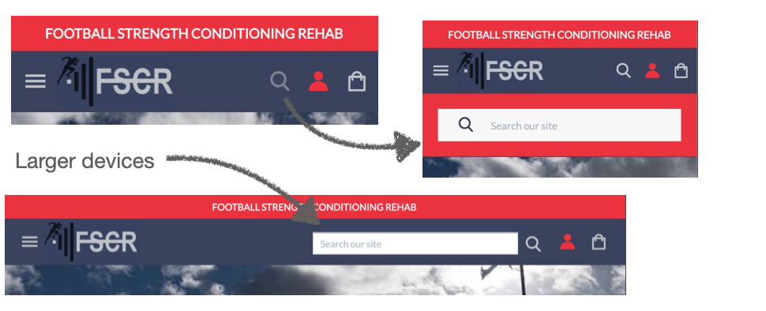

**19. Easily see what I’ve searched for and the number of results**

<u>Purchasing and checkout</u>

**20. Easily select the size and quantity of a product/programme when purchasing it**

The product detail page allows a user to select a specific size, if the product is sized, and the quantity of a product.
The programme detail page allows a user to select a quantity of a programme to add to their bag.

**21. View items in my bag to be purchased**

The bag view allows the user to view all the products and programmes they have added to their bag before continuing to the checkout.

**22. Adjust the quantity of individual items in my bag**

The user has the ability to adjust the quantity of products and programmes in their bag before continuing to checkout.

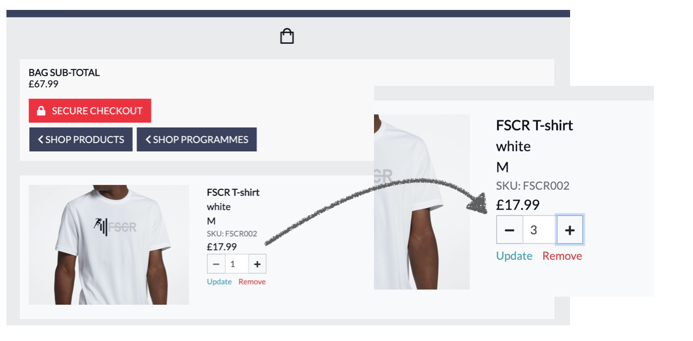

**23. Easily enter my payment information**

The checkout page features a payment form allowing the user to easily enter their card details for a quick checkout.

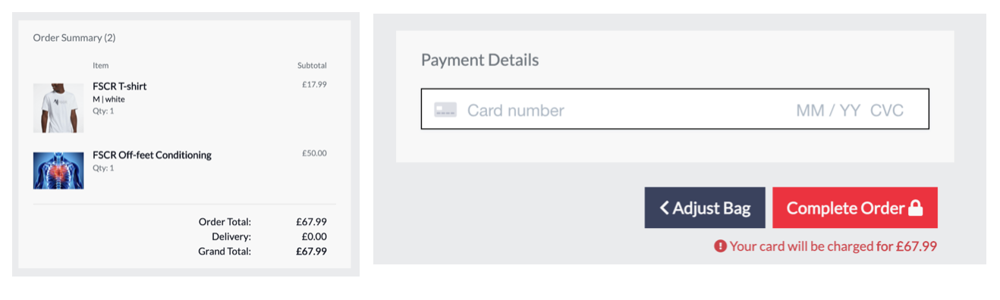

**24. Feel my personal and payment information is safe and secure**

**25. View an order confirmation after checkout**

Once the user has made a purchase they are directed to a checkout success page where they can see a summary of their order so they are able to check that they haven't made any mistakes.

**26. Receive an email confirmation after checking out**

Once the user has made a purchase they are sent an email with a summary of their order to keep for their own records.

<u>Admin and Store Management</u>

**27. Add a product/programme**

When logged in as the admin user, the user has the option of 'product management' and 'programme management' when clicking on the profile icon on the main site header. After clicking the link they are directed to a page displayed with a form to enter all the information needed to add a new product/programme.

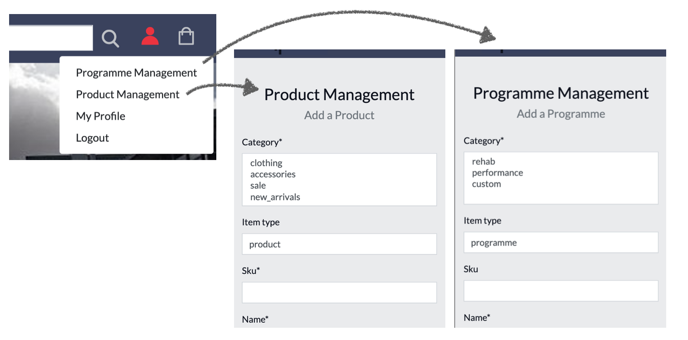

**28. Edit/Update a product/programme**

When logged in as admin user, the user has an edit button displayed under each product/programme card on the products/programmes page, as well as on each product/programme detail page. After clicking 'edit' from either view the user is directed to the edit product/programme page which is a pre-filled out form allowing the fields to be ammended manually from the site. Once the user has finished with their edits they can click 'update information' and the new product/programme information will be saved, and they will be redirected back to the products/programmes page.

**29. Delete a product/programme**

When logged in as admin user, the user has a delete button displayed next to the edit button. After clicking 'delete' from either view, the product/programme is permanently deleted from the site and will no longer show on the products/programmes page.

(See user story above displaying the delete button)

**30. Add a blog**

When logged into the admin, the admin user can add a new blog to the site. I didn't think it was nessessary to add a manual function for adding a blog as these will be posted less frequently and have little chance of needing modifications after being posted.

### **Manual function testing**

To ensure my site was working correctly I carried out some manual function testing;

**Navigation**
  - I checked the site dropdown menu was working correctly by starting on the home-page and navigating around the site from and to every screen the user would be faced with.
  - I checked the logo homepage navigation was working by clicking on the brand image from every page.
  - **404 Error page**: I decided to create a custom 404.html page for my user so if they are directed to a non-existent domain, they are presented with an appealing page and an easy navigation button back to the homepage.

    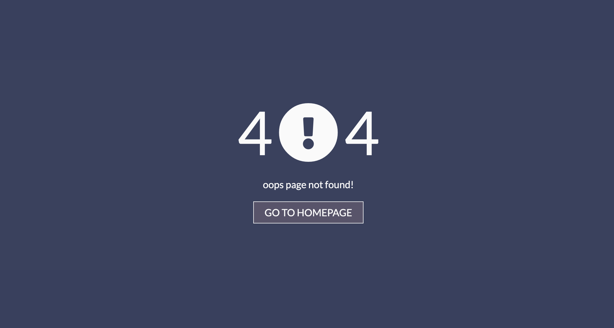

**Authorisation**

  - To check the login functionality was working I first clicked on the profile icon and clicked 'login' to ensure I was directed to the correct page. When presented with the modal I conducted various checks;
    - I filled out the login form with an already registered username and password then clicked 'Login'.
    - I filled out the login form with a new username and password then clicked 'Login'.

- To check the Register functionality was working I first clicked on the profile icon and clicked 'register' to ensure I was directed to the correct page.
  - I filled out the registration form with a new username and password then clicked 'Register'.
  - I filled out the login form with an already registered username and password then clicked 'Register'.

<u>Site user/member</u>
  - Once I was logged in, the options available under the profile icon changed to 'my profile' and 'log out'. I was also able to access the blog and forum page.

<u>Site Owner</u>
- Once I was logged in, the options available under the profile icon changed to 'my profile', log out', 'product management' and 'programme management'. I was also able to access the blog and forum page.

**Form validation**

**Home**

<u>Contact form JS functionality</u>

- I checked the contact form was working correctly by filling out the form and clicking submit. I received a browser 'SUCCESS' response, the form cleared and I recieved an email, so I know the functionality was working.

**Products**

<u>View product functionality</u>

- I clicked on each product card to make sure it displayed the correct information to me when navigated to the view product HTML template, and it did.

<u>Add product functionality</u>

I logged in as admin user to check that the product management option was displayed in the profile menu, and it was. I then filled out the form and submitted and checked that the product was added to the products page.

<u>Edit product functionality</u>

When logged in as admin user I checked that the edit button was visible for all products on the programmes page, as well as on each individual view page. I then tested the functionality but clicking on the button and checking that i was directed to the edit page with all fields pre-filled with current information. I then made an amendment and clicked 'save changes' and checke that the information had been updated.

<u>Delete product functionality</u>

I checked the delete function buttons were all visible when logged in as admin and that when clicked the product was removed from the site.

**Programmes**

<u>View prgramme functionality</u>

- I clicked on each programme card to make sure it displayed the correct information to me when navigated to the view programme HTML template, and it did.

<u>Add programme functionality</u>

I logged in as admin user to check that the programme management option was displayed in the profile menu, and it was. I then filled out the form and submitted and checked that the programme was added to the programmes page.

<u>Edit programme functionality</u>

When logged in as admin user I checked that the edit button was visible for all programmes on the programmes page, as well as on each individual view page. I then tested the functionality but clicking on the button and checking that i was directed to the edit page with all fields pre-filled with current information. I then made an amendment and clicked 'save changes' and checke that the information had been updated.

<u>Delete programme functionality</u>

I checked the delete function buttons were all visible when logged in as admin and that when clicked the programme was removed from the site.

**Bag**

<u>Add to bag functionality</u>

I checked that my add to bag function was working by selecting a range of products and programmes and adding them to the bag to check there was no errors. Whilst creating this function I did experience difficulty adding from using id's to target products from different apps. I rectified this by adding in category to the url so i could differentiate products from programmes.

<u>View bag functionality</u>

**Checkout**

<u>Completing stripe payment</u>

<u>Pre-filled checkout details</u>

**Blog**

<u>View blog functionality</u>

<u>Commenting on blog</u>

When logged in as a member/admin I clicked onto a variety of forums and entered a comment into the text field and clicked 'post'. I could see that the comment had been added below with the correct logged in username and date/time so I knew the functionality was working correctly.

**Forum**

<u>View thread functionality</u>

<u>Adding Thread</u>

I checked that the functionality for adding a thread to the forum was working by logging in as a member/admin and clicking 'add thread' on the forums page. I was directed to a form to fill and when clicking 'post' I could see that my thread had been added to the forum page so I knew it was working correctly.

<u>Commenting on forum</u>

When logged in as a member/admin I clicked onto a variety of forums and entered a comment into the text field and clicked 'post'. I could see that the comment had been added below with the correct logged in username and date/time so I knew the functionality was working correctly.

### **Automated testing**

I also decided to use Django's testing framework to create some automated tests for my prpject.

### **Validator checks**

The W3C Markup Validator and W3C CSS Validator Services were used to validate every page of the project to ensure there were no syntax errors in the project. The code was entered through direct input. JS hint was used to check for any errors with my Javascript files. 
JS was also tested by opening the developer console window on Chrome and checking for any errors as I clicked through the site.
I used the PEP8 online checking tool to inspect my Python code against the style conventions in PEP 8.

- [**HTML Validator**](https://validator.w3.org/)

- [**CSS Validator**](https://jigsaw.w3.org/css-validator/)

- [**JS hint**](https://jshint.com/)

- **Developer tools**

- [**PEP8 online check**](http://pep8online.com/checkresult)

### **Audits**

[Lighthouse](https://developers.google.com/web/tools/lighthouse) was used to run a series of audits to improve the quality of web pages. Overall performance and errors are highlighted below.

### **Responsive Design**

- Site created as a mobile-first design.

- Viewport tag included in the head of HTML files to tell the browser how to respond to different resolutions, particularly mobile ones.

- Media queries used in the CSS file to target larger devices.

### **Additional Testing**

### **Bugs**

|     | Bug                                                                           | Action                                                            |
|-----|-------------------------------------------------------------------------------|-------------------------------------------------------------------|
| [] | Search icon showing border on ios                     |  need to solve |
| [] | Homepage postioning not filling screen as including search bar in vh                     |  need to solve |